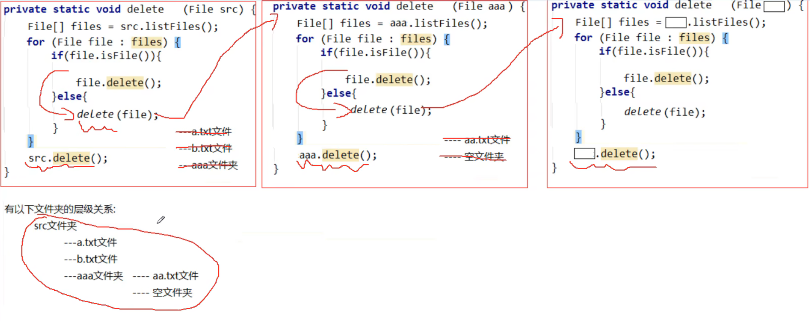

# 1. 异常

## 1.1 异常概念

异常，就是不正常的意思。在生活中:医生说,你的身体某个部位有异常,该部位和正常相比有点不同,该部位的功能将受影响.在程序中的意思就是：

* **异常** ：指的是程序在执行过程中，出现的非正常的情况，最终会导致JVM的非正常停止。

在Java等面向对象的编程语言中，异常本身是一个类，产生异常就是创建异常对象并抛出了一个异常对象。Java处理异常的方式是中断处理。

> 异常指的并不是语法错误,语法错了,编译不通过,不会产生字节码文件,根本不能运行.

## 1.2 异常体系

异常机制其实是帮助我们**找到**程序中的问题，异常的根类是`java.lang.Throwable`，其下有两个子类：`java.lang.Error`与`java.lang.Exception`，平常所说的异常指`java.lang.Exception`。


**Throwable体系：**

* **Error**:严重错误Error，无法通过处理的错误，只能事先避免，好比绝症。
* **Exception**:表示异常，异常产生后程序员可以通过代码的方式纠正，使程序继续运行，是必须要处理的。好比感冒、阑尾炎。

**Throwable中的常用方法：**

* `public void printStackTrace()`:打印异常的详细信息。

  *包含了异常的类型,异常的原因,还包括异常出现的位置,在开发和调试阶段,都得使用printStackTrace。*

* `public String getMessage()`:获取发生异常的原因。

  *提示给用户的时候,就提示错误原因。*

* `public String toString()`:获取异常的类型和异常描述信息(不用)。

***出现异常,不要紧张,把异常的简单类名,拷贝到API中去查。***


## 1.3 异常分类

我们平常说的异常就是指Exception，因为这类异常一旦出现，我们就要对代码进行更正，修复程序。

**异常(Exception)的分类**:根据在编译时期还是运行时期去检查异常?

* **编译时期异常**:checked异常。在编译时期,就会检查,如果没有处理异常,则编译失败。(如日期格式化异常)==提醒程序员检查本地信息==
* **运行时期异常**:runtime异常。在运行时期,检查异常.在编译时期,运行异常不会编译器检测(不报错)。(如数学异常)==代码出错而导致程序出现的问题==

```java
package com.itheima.exception;

import java.text.ParseException;

public class ExceptionDemo1 {
    public static void main(String[] args) throws ParseException {

        //编译时异常(在编译阶段,必须要手动处理,否则代码报错)
       /* String time = "2030年1月1日";
        SimpleDateFormat sdf = new SimpleDateFormat("yyyy年MM月dd日");
        Date date = sdf.parse(time);
        System.out.println(date);*/

        //运行时异常(在编译阶段是不需要处理的,是代码运行时出现的异常)
        int[] arr = {1, 2, 3, 4, 5};
        System.out.println(arr[10]);//ArrayIndexOutOfBoundsException
    }
}

```

 

### 异常的作用

- 作用一:异常是用来查询bug的关键参数信息

```java
package com.itheima.exception;

public class ExceptionDemo2 {
    public static void main(String[] args) {
        /*
            异常作用一：异常是用来查询bug的关键参考信息
            异常作用二：异常可以作为方法内部的一种特殊返回值，以便通知调用者底层的执行情况
         */

        Student[] arr = new Student[3];//null   null    null
        String name = arr[0].getName();
        System.out.println(name);
    }
}

```

- ==作用二:==异常可以作为方法内部的一种特殊返回值,以便通知调用者底层的执行情况

```java
package com.itheima.exception;

public class ExceptionDemo4 {
    public static void main(String[] args) {
        /*
            异常作用一：异常是用来查询bug的关键参考信息
            异常作用二：异常可以作为方法内部的一种特殊返回值，以便通知调用者底层的执行情况
        */


        //1.创建学生对象
        Student s1 = new Student();
        //年龄：（同学） 18~40岁
        s1.setAge(50);//就知道了50赋值失败
                    //选择1：自己悄悄处理
                    //选择2：打印在控制台上


    }
}

```

```java
package com.itheima.exception;

public class Student {
    private String name;
    private int age;


    public Student() {
    }

    public Student(String name, int age) {
        this.name = name;
        this.age = age;
    }

    public String getName() {
        return name;
    }

    public void setName(String name) {
        this.name = name;
    }

    public int getAge() {
        return age;
    }

    public void setAge(int age) {
        if (age < 18 || age > 40) {
            //System.out.println("年龄超出范围");
            throw new RuntimeException();
        } else {
            this.age = age;
        }
    }

    public String toString() {
        return "Student{name = " + name + ", age = " + age + "}";
    }
}

```

## 1.4 异常的产生过程解析(jvm默认处理异常方式)

先运行下面的程序，程序会产生一个数组索引越界异常ArrayIndexOfBoundsException。我们通过图解来解析下异常产生的过程。

 工具类

```java
public class ArrayTools {
    // 对给定的数组通过给定的角标获取元素。
    public static int getElement(int[] arr, int index) {
        int element = arr[index];
        return element;
    }
}
```

 测试类

```java
public class ExceptionDemo {
    /*
        JVM默认处理异常的方式：
            1. 把异常的名称，异常原因及异常出现的位置等信息输出在了控制台
            2. 程序停止执行，异常下面的代码不会再执行了
        */
    public static void main(String[] args) {
        int[] arr = { 34, 12, 67 };
        intnum = ArrayTools.getElement(arr, 4)
        System.out.println("num=" + num);
        System.out.println("over");
    }
}
```

上述程序执行过程图解：

 

## 1.5 抛出异常throw

在编写程序时，我们必须要考虑程序出现问题的情况。比如，在定义方法时，方法需要接受参数。那么，当调用方法使用接受到的参数时，首先需要先对参数数据进行合法的判断，数据若不合法，就应该告诉调用者，传递合法的数据进来。这时需要使用抛出异常的方式来告诉调用者。

在java中，提供了一个**throw**关键字，它用来抛出一个指定的异常对象。那么，抛出一个异常具体如何操作呢？

1. 创建一个异常对象。封装一些提示信息(信息可以自己编写)。

2. 需要将这个异常对象告知给调用者。怎么告知呢？怎么将这个异常对象传递到调用者处呢？通过关键字throw就可以完成。throw 异常对象。

   **注意**:throw**写在方法内**，手动抛出异常对象,交给调用者,方法下面的代码不再执行了,结束方法。

**使用格式：**

```
修饰符 返回值类型 方法名(){
	throw new 异常类名(参数);
}
```

 例如：

```java
throw new NullPointerException("要访问的arr数组不存在");

throw new ArrayIndexOutOfBoundsException("该索引在数组中不存在，已超出范围");
```

学习完抛出异常的格式后，我们通过下面程序演示下throw的使用。

```java
public class ThrowDemo {
    public static void main(String[] args) {
        //创建一个数组 
        int[] arr = {2,4,52,2};
        //根据索引找对应的元素 
        int index = 4;
        int element = getElement(arr, index);

        System.out.println(element);
        System.out.println("over");
    }
    /*
     * 根据 索引找到数组中对应的元素
     */
    public static int getElement(int[] arr,int index){ 
       	//判断  索引是否越界
        if(index<0 || index>arr.length-1){
             /*
             判断条件如果满足，当执行完throw抛出异常对象后，方法已经无法继续运算。
             这时就会结束当前方法的执行，并将异常告知给调用者。这时就需要通过异常来解决。 
              */
             throw new ArrayIndexOutOfBoundsException("哥们，角标越界了```");
        }
        int element = arr[index];
        return element;
    }
}
```

> 注意：如果产生了问题，我们就会throw将问题描述类即异常进行抛出，也就是将问题返回给该方法的调用者。
>
> 那么对于调用者来说，该怎么处理呢？一种是进行捕获处理，另一种就是继续讲问题声明出去，使用throws声明处理。

## 1.6 声明异常throws

**声明异常**：将问题标识出来，报告给调用者。如果方法内通过throw抛出了编译时异常，而没有捕获处理，那么必须通过throws进行声明，让调用者去处理。

**注意**:**throws写在方法定义处**,声明一个异常告诉调用者.用于表示当前方法不处理异常,提醒该方法的调用者来处理异常(抛出异常).

**声明异常格式：**

```
修饰符 返回值类型 方法名(参数) throws 异常类名1,异常类名2…{   }	
```

- **编译时异常**:必须要写
- **运行时异常:**可以不写

声明异常的代码演示：

```java
public class ThrowsDemo {
    public static void main(String[] args) throws FileNotFoundException {
        read("a.txt");
    }

    // 如果定义功能时有问题发生需要报告给调用者。可以通过在方法上使用throws关键字进行声明
    public static void read(String path) throws FileNotFoundException {
        if (!path.equals("a.txt")) {//如果不是 a.txt这个文件 
            // 我假设  如果不是 a.txt 认为 该文件不存在 是一个错误 也就是异常  throw
            throw new FileNotFoundException("文件不存在");
        }
    }
}
```

throws用于进行异常类的声明，若该方法可能有多种异常情况产生，那么在throws后面可以写多个异常类，用逗号隔开。

```java
public class ThrowsDemo2 {
    public static void main(String[] args) throws IOException {
        read("a.txt");
    }

    public static void read(String path)throws FileNotFoundException, IOException {
        if (!path.equals("a.txt")) {//如果不是 a.txt这个文件 
            // 我假设  如果不是 a.txt 认为 该文件不存在 是一个错误 也就是异常  throw
            throw new FileNotFoundException("文件不存在");
        }
        if (!path.equals("b.txt")) {
            throw new IOException();
        }
    }
}
```

```java
package com.itheima.exception;

public class ExceptionDemo12 {
    public static void main(String[] args) {
        /*
            throws：写在方法定义处，表示声明一个异常。告诉调用者，使用本方法可能会有哪些异常。
        throw ：写在方法内，结束方法。手动抛出异常对象，交给调用者。方法中下面的代码不再执行了。


        需求：
            定义一个方法求数组的最大值
         */

        int[] arr = null;
        int max = 0;
        try {
            max = getMax(arr);
        } catch (ArrayIndexOutOfBoundsException e) {
            System.out.println("索引越界异常");
        }catch (NullPointerException e){
            System.out.println("空指针异常");
        }
        System.out.println(max);
    }

    public static int getMax(int[] arr) /*throws NullPointerException, ArrayIndexOutOfBoundsException*/ {
        if (arr == null) {
            //手动创建一个异常对象,并把这个异常交给方法的调用者处理
            //此时方法就会结束,下面的代码不会再执行了
            throw new NullPointerException();
        }

        if (arr.length == 0) {
            //手动创建一个异常对象,并把这个异常交给方法的调用者处理
            //此时方法就会结束,下面的代码不会再执行了
            throw new ArrayIndexOutOfBoundsException();

        }
        System.out.println("看看我执行了吗");
        int max = arr[0];
        for (int i = 1; i < arr.length; i++) {
            if (arr[i] > max) {
                max = arr[i];
            }
        }
        return max;
    }

}

```

## 1.7 捕获异常try…catch(自己处理异常)

如果异常出现的话,会立刻终止程序,所以我们得处理异常:

1. 该方法不处理,而是声明抛出,由该方法的调用者来处理(throws)。
2. 在方法中使用try-catch的语句块来处理异常。

**try-catch**的方式就是捕获异常。

* **捕获异常**：Java中对异常有针对性的语句进行捕获，可以对出现的异常进行指定方式的处理。

捕获异常语法如下：

```java
try{
     编写可能会出现异常的代码
}catch(异常类型  e){
     处理异常的代码
     //记录日志/打印异常信息/继续抛出异常
}
```

**目的**:当代码出现异常时,可以让程序继续往下执行(一般用在调用处)

**好处**:可以让程序继续往下执行,不会停止

**try：**该代码块中编写可能产生异常的代码。

**catch：**用来进行某种异常的捕获，实现对捕获到的异常进行处理。

> 注意:try和catch都不能单独使用,必须连用。

演示如下：

```java
public class TryCatchDemo {
    public static void main(String[] args) {
        try {// 当产生异常时，必须有处理方式。要么捕获，要么声明。
            read("b.txt");
        } catch (FileNotFoundException e) {// 括号中需要定义什么呢？
          	//try中抛出的是什么异常，在括号中就定义什么异常类型
            System.out.println(e);
        }
        System.out.println("over");
    }
    /*
     *
     * 我们 当前的这个方法中 有异常  有编译期异常
     */
    public static void read(String path) throws FileNotFoundException {
        if (!path.equals("a.txt")) {//如果不是 a.txt这个文件 
            // 我假设  如果不是 a.txt 认为 该文件不存在 是一个错误 也就是异常  throw
            throw new FileNotFoundException("文件不存在");
        }
    }
}
```

```java
package com.itheima.exception;

public class ExceptionDemo6 {
    public static void main(String[] args) {
        /*
            自己处理（捕获异常）
            格式：
                try {
                   可能出现异常的代码;
                } catch(异常类名 变量名) {
                   异常的处理代码;
                }
             好处:可以让程序继续往下执行，不会停止
         */
        int[] arr = {1, 2, 3, 4, 5, 6};

        try {
            //可能出现异常的代码
            System.out.println(arr[10]);//此处出现了异常,程序就会在这里创建一个ArrayIndexOutOfBoundsException对象
                                        //new ArrayIndexOutOfBoundsException();
                                        //拿着这个对象到catch的小括号中对比,看括号中的变量是否可以接受这个对象
                                        //如果能被接收,就表示该异常就被捕获(抓住),执行catch对应的代码
                                        //当catch中的所有代码执行完毕,继续执行try...catch体系下面的其他代码
        } catch (ArrayIndexOutOfBoundsException e) {
            //如果出现了ArrayIndexOutOfBoundsException异常,我该如何处理
            System.out.println("索引越界了");
        }

        System.out.println("看看我执行了吗");
    }
}

```

### 问题

1. 灵魂一问：如果try中没有遇到问题，怎么执行？

   **会把try里面所有的代码全部执行完毕,不会执行catch里面的代码**

```java
package com.itheima.exception;

public class ExceptionDemo7 {
    public static void main(String[] args) {
         /*
            自己处理（捕获异常）灵魂四问：
                灵魂一问：如果try中没有遇到问题，怎么执行？
                            会把try里面所有的代码全部执行完毕，不会执行catch里面的代码
                            注意：
                                只有当出现了异常才会执行catch里面的代码


         */

        int[] arr = {1, 2, 3, 4, 5, 6};

        try {
            System.out.println(arr[0]);//1
        } catch (ArrayIndexOutOfBoundsException e) {
            System.out.println("索引越界了");
        }

        System.out.println("看看我执行了吗？");//看看我执行了吗？
    }
}

```

2. 灵魂二问：如果try中可能会遇到多个问题，怎么执行？

   **会写多个catch与之对应,父类异常需要写在下面**

```java
package com.itheima.exception;

public class ExceptionDemo8 {
    public static void main(String[] args) {
         /*
            自己处理（捕获异常）灵魂四问：
                灵魂二问：如果try中可能会遇到多个问题，怎么执行？
                        会写多个catch与之对应
                        细节：
                            如果我们要捕获多个异常，这些异常中如果存在父子关系的话，那么父类一定要写在下面

                        了解性：
                            在JDK7之后，我们可以在catch中同时捕获多个异常，中间用|进行隔开
                            表示如果出现了A异常或者B异常的话，采取同一种处理方案

         */
        //JDK7
        int[] arr = {1, 2, 3, 4, 5, 6};

        try {
            System.out.println(arr[10]);//ArrayIndexOutOfBoundsException
            System.out.println(2 / 0);//ArithmeticException
            String s = null;
            System.out.println(s.equals("abc"));
        } catch (ArrayIndexOutOfBoundsException | ArithmeticException e) {
            System.out.println("索引越界了");
        }catch (NullPointerException e) {
            System.out.println("空指针异常");
        }catch (Exception e){
            System.out.println("Exception");
        }

        System.out.println("看看我执行了吗");
    }
}

```

多个异常使用捕获又该如何处理呢？

1. 多个异常分别处理。
2. 多个异常一次捕获，多次处理。
3. 多个异常一次捕获一次处理。

一般我们是使用一次捕获多次处理方式，格式如下：

```java
try{
     编写可能会出现异常的代码
}catch(异常类型A  e){  当try中出现A类型异常,就用该catch来捕获.
     处理异常的代码
     //记录日志/打印异常信息/继续抛出异常
}catch(异常类型B  e){  当try中出现B类型异常,就用该catch来捕获.
     处理异常的代码
     //记录日志/打印异常信息/继续抛出异常
}
```

> 注意:这种异常处理方式，要求多个catch中的异常不能相同，并且若catch中的多个异常之间有子父类异常的关系，那么子类异常要求在上面的catch处理，父类异常在下面的catch处理。

3. 如果try中遇到问题没有被捕获,怎么执行?

   **相当于try...catch白写了,当前异常会交给虚拟机处理**

```java
package com.itheima.exception;

public class ExceptionDemo9 {
    public static void main(String[] args) {
        /*
        自己处理(捕获异常)灵魂三问:
            如果try中遇到问题没有被捕获,怎么执行
            相当于try...catch的代码白写了,最终还是会交给虚拟机进行处理
         */
        int[] arr = {1, 2, 3, 4, 5, 6};
        try {
            System.out.println(arr[10]);//new ArrayIndexOutOfBoundsException();
        } catch (NullPointerException e) {
            System.out.println("空指针异常");
        }

        System.out.println("看看我执行了吗");
    }
}

```

4. 如果try中遇到了问题,那么try下面的其他代码还会执行吗?

   **不会执行了.try中遇到问题,直接跳转到对应的catch,如果没有对应的catch与之匹配,则交给虚拟机处理**

```java
package com.itheima.exception;

public class ExceptionDemo10 {
    public static void main(String[] args) {
        /*
            自己处理(捕获异常)灵魂四问:
                如果try中遇到了问题,那么try下面的其他代码还会执行吗?
                下面的代码就不会执行了,直接跳转到对应的catch中,执行catch里面的语句体
                但是如果没有对应的catch与之匹配,那么还是会交给虚拟机进行处理
         */

        int[] arr = {1, 2, 3, 4, 5, 6};
        try {
            System.out.println(arr[10]);//new ArrayIndexOutOfBoundsException();
            System.out.println("看看我执行了吗? ...try");
        } catch (ArrayIndexOutOfBoundsException e) {
            System.out.println("索引越界了");
        }
        System.out.println("看看我执行了吗? ...其他代码");

    }
}

```

### 如何获取异常信息

Throwable类中定义了一些查看方法:

| 方法名称                      | 说明                                                         |
| ----------------------------- | ------------------------------------------------------------ |
| public String getMessage()    | 获取异常的描述信息,原因(提示给用户的时候,就提示错误原因)     |
| public String toString()      | 获取异常的类型和异常描述信息(不用)                           |
| public void printStackTrace() | 打印异常的跟踪栈信息并输出到控制台(细节:仅仅是打印信息,不会停止程序运行) |

​            *包含了异常的类型,异常的原因,还包括异常出现的位置,在开发和调试阶段,都得使用printStackTrace。*

在开发中呢也可以在catch将编译期异常转换成运行期异常处理。

```java
package com.itheima.exception;

public class ExceptionDemo11 {
    public static void main(String[] args) {
        /*
            public String getMessage()      返回throwable的详细消息字符串
            public String toString()        返回此可能抛出的简短描述

            public void printStackTrace()   在底层是利用System.err.println进行输出
                                            把异常的错误信息以红色字体输出在控制台
                                            细节:仅仅是打印信息,不会停止程序运行
         */

        int[] arr = {1,2,3,4,5,6};

        /*try {
            System.out.println(arr[10]);
        } catch (ArrayIndexOutOfBoundsException e) {
           *//* String message = e.getMessage();
            System.out.println(message);//Index 10 out of bounds for length 6*//*
            *//*String str = e.toString();
            System.out.println(str);//java.lang.ArrayIndexOutOfBoundsException: Index 10 out of bounds for length 6*//*
            e.printStackTrace();//
            //throw new RuntimeException(e);
        }

        System.out.println("看看我执行了吗");*/

        //正常的输出语句
        //System.out.println(123);

        //错误的输出语句(而是用来打印错误信息)
        //多线程
        //System.err.println(123);
    }
}
```

## 1.8 finally 代码块

**finally**：有一些特定的代码无论异常是否发生，都需要执行。另外，因为异常会引发程序跳转，导致有些语句执行不到。而finally就是解决这个问题的，在finally代码块中存放的代码都是一定会被执行的。

什么时候的代码必须最终执行？

当我们在try语句块中打开了一些物理资源(磁盘文件/网络连接/数据库连接等),我们都得在使用完之后,最终关闭打开的资源。

finally的语法:

 try...catch....finally:自身需要处理异常,最终还得关闭资源。

> 注意:finally不能单独使用。

比如在我们之后学习的IO流中，当打开了一个关联文件的资源，最后程序不管结果如何，都需要把这个资源关闭掉。

finally代码参考如下：

```java
public class TryCatchDemo4 {
    public static void main(String[] args) {
        try {
            read("a.txt");
        } catch (FileNotFoundException e) {
            //抓取到的是编译期异常  抛出去的是运行期 
            throw new RuntimeException(e);
        } finally {
            System.out.println("不管程序怎样，这里都将会被执行。");
        }
        System.out.println("over");
    }
    /*
     *
     * 我们 当前的这个方法中 有异常  有编译期异常
     */
    public static void read(String path) throws FileNotFoundException {
        if (!path.equals("a.txt")) {//如果不是 a.txt这个文件 
            // 我假设  如果不是 a.txt 认为 该文件不存在 是一个错误 也就是异常  throw
            throw new FileNotFoundException("文件不存在");
        }
    }
}
```

> 当只有在try或者catch中调用退出JVM的相关方法,此时finally才不会执行,否则finally永远会执行。

## 1.9 异常注意事项

* 运行时异常被抛出可以不处理。即不捕获也不声明抛出。
* 如果父类抛出了多个异常,子类覆盖父类方法时,只能抛出相同的异常或者是他的子集。
* 父类方法没有抛出异常，子类覆盖父类该方法时也不可抛出异常。此时子类产生该异常，只能捕获处理，不能声明抛出
* 当多异常处理时，捕获处理，前边的类不能是后边类的父类
* 在try/catch后可以追加finally代码块，其中的代码一定会被执行，通常用于资源回收。

## 1.10 自定义异常概述

**为什么需要自定义异常类:**

我们说了Java中不同的异常类,分别表示着某一种具体的异常情况,那么在开发中总是有些异常情况是SUN没有定义好的,此时我们根据自己业务的异常情况来定义异常类。,例如年龄负数问题,考试成绩负数问题。

在上述代码中，发现这些异常都是JDK内部定义好的，但是实际开发中也会出现很多异常,这些异常很可能在JDK中没有定义过,例如年龄负数问题,考试成绩负数问题.那么能不能自己定义异常呢？

**什么是自定义异常类:**

在开发中根据自己业务的异常情况来定义异常类.

自定义一个业务逻辑异常: **LoginException**。一个登陆异常类。

**异常类如何定义:**

1. 定义异常类(见名知意)

2. 写继承关系

   自定义一个编译期异常: 自定义类 并继承于`java.lang.Exception`。

   自定义一个运行时期的异常类:自定义类 并继承于`java.lang.RuntimeException`。

3. 空参构造

4. 带参构造

**意义**:就是为了让控制台的报错信息更加的见名知意

## 1.11 自定义异常的练习

要求：我们模拟登陆操作，如果用户名已存在，则抛出异常并提示：亲，该用户名已经被注册。

首先定义一个登陆异常类LoginException：

```java
// 业务逻辑异常
public class LoginException extends Exception {
    /**
     * 空参构造
     */
    public LoginException() {
    }

    /**
     *
     * @param message 表示异常提示
     */
    public LoginException(String message) {
        super(message);
    }
}
```

模拟登陆操作，使用数组模拟数据库中存储的数据，并提供当前注册账号是否存在方法用于判断。

```java
public class Demo {
    // 模拟数据库中已存在账号
    private static String[] names = {"bill","hill","jill"};
   
    public static void main(String[] args) {     
        //调用方法
        try{
            // 可能出现异常的代码
            checkUsername("nill");
            System.out.println("注册成功");//如果没有异常就是注册成功
        } catch(LoginException e) {
            //处理异常
            e.printStackTrace();
        }
    }

    //判断当前注册账号是否存在
    //因为是编译期异常，又想调用者去处理 所以声明该异常
    public static boolean checkUsername(String uname) throws LoginException {
        for (String name : names) {
            if(name.equals(uname)){//如果名字在这里面 就抛出登陆异常
                throw new LoginException("亲"+name+"已经被注册了！");
            }
        }
        return true;
    }
}
```

```java
package com.itheima.test;

public class NameFormatException extends RuntimeException{
    //技巧:
    //NameFormat:当前异常的名字,表示姓名格式化问题
    //Exception:表示当前类是一个异常类

    //运行时:RuntimeException  核心  就表示参数问题而导致的问题
    //编译时:Exception 核心 提醒程序员检查本地信息


    public NameFormatException() {
    }

    public NameFormatException(String message) {
        super(message);
    }
}

```

```java
package com.itheima.test;

public class AgeOutOfBoundsException extends RuntimeException{
    public AgeOutOfBoundsException() {
    }

    public AgeOutOfBoundsException(String message) {
        super(message);
    }
}

```

## 异常练习

```java
package com.itheima.test;

import java.util.Scanner;

public class Test {
    public static void main(String[] args) {
        /*
            需求:
                键盘录入自己心仪的女朋友姓名和年龄
                姓名的长度在 3 - 10 之间
                年龄的范围在 18 - 40 之间
                超出这个范围的是异常数据不能赋值,需要重新录入,一直到正确为止
            提示:
                需要考虑用户在键盘录入时的所有情况
                比如:录入年龄时超出范围,录入年龄时录入abc等情况
         */

        //1.创建键盘录入的对象
        Scanner sc = new Scanner(System.in);

        //2.创建女朋友对象
        GirlFriend gf = new GirlFriend();

        while (true) {
            try {
                //3.接收女朋友的姓名
                System.out.println("请输入姓名");
                String name = sc.nextLine();
                gf.setName(name);

                //4.接收女朋友的年龄
                System.out.println("请输入年龄");
                String strAge = sc.nextLine();
                int age = Integer.parseInt(strAge);
                gf.setAge(age);
                break;
            } catch (NumberFormatException e) {
               e.printStackTrace();
            }catch (NameFormatException e){
                e.printStackTrace();
            }catch (AgeOutOfBoundsException e){
                e.printStackTrace();
            }
        }

        //5.打印女朋友的信息
        System.out.println(gf);
    }
}

```

```java
package com.itheima.test;

public class GirlFriend {
    private String name;
    private int age;

    public GirlFriend() {
    }

    public GirlFriend(String name, int age) {
        this.name = name;
        this.age = age;
    }

    public String getName() {
        return name;
    }

    public void setName(String name) {
        int len = name.length();
        if (len < 3 || len > 10) {
            throw new NameFormatException(name + "格式有误,长度应为3 - 10");
        }
        this.name = name;
    }

    public int getAge() {
        return age;
    }

    public void setAge(int age) {
        if (age < 18 || age > 40) {
            throw new AgeOutOfBoundsException(age + "超出范围");
        }
        this.age = age;
    }

    public String toString() {
        return "GirlFriend{name = " + name + ", age = " + age + "}";
    }
}

```

# 2. File类

## 2.1 概述

`java.io.File` 类是文件和目录路径名的抽象表示，主要用于文件和目录的创建、查找和删除等操作。

## 2.2 构造方法

| 方法名称                                 | 说明                                                         |
| ---------------------------------------- | ------------------------------------------------------------ |
| public File(String pathname)             | 通过将给定的**路径名字符串**转换为抽象路径名来创建新的 File实例 |
| public File(String parent, String child) | 从**父路径名字符串和子路径名字符串**创建新的 File实例        |
| public File(File parent, String child)   | 从**父抽象路径名和子路径名字符串**创建新的 File实例          |

- 构造举例，代码如下：

```java
package com.itheima.file;

import java.io.File;

public class FileDemo1 {
    public static void main(String[] args) {
        /*
            public File(String pathname)                根据文件路径创建文件对象
            public File(String parent, String child)    根据父路径名字符串和子路径名字符串创建文件对象
            public File(File parent, String child)      根据父路径对应文件对象和子路径名字符串创建文件对象

           C:\Users\W1660\Desktop

           \:转义字符

           WINDOWS: \
           LINUX: /
         */

        //1.根据字符串表示的路径,变成File对象
        String str = "C:\\Users\\W1660\\Desktop\\a.txt";
        File f1 = new File(str);
        System.out.println(f1);//C:\Users\W1660\Desktop\a.txt

        //2.父级路径:C:\Users\W1660\Desktop
        //子级路径:a.txt
        String parent = "C:\\Users\\W1660\\Desktop";
        String child = "a.txt";
        File f2 = new File(parent,child);
        System.out.println(f2);//C:\Users\W1660\Desktop\a.txt

        File f3 = new File(parent + "\\" + child);
        System.out.println(f3);//C:\Users\W1660\Desktop\a.txt

        //3.把一个File表示的路径和String表示路径进行拼接
        File parent2 = new File("C:\\Users\\W1660\\Desktop");
        String child2 = "a.txt";
        File f4 = new File(parent2,child2);
        System.out.println(f4);//C:\Users\W1660\Desktop\a.txt

    }
}
```

> 小贴士：
>
> 1. 一个File对象代表硬盘中实际存在的一个文件或者目录。
> 2. 无论该路径下是否存在文件或者目录，都不影响File对象的创建。

## 2.3 常用方法

### 获取功能的方法

| 方法名称                           | 说明                                      |
| ---------------------------------- | ----------------------------------------- |
| `public String getAbsolutePath() ` | 返回此File的绝对路径名字符串              |
| ` public String getPath() `        | 将此File转换为路径名字符串                |
| `public String getName()`          | 返回由此File表示的文件或目录的名称,带后缀 |
| `public long length()`             | 返回由此File表示的文件的长度(字节数量)    |
| `public long lastModified()`       | 返回文件的最后修改时间(时间毫秒值)        |

方法演示，代码如下：

```java
package com.itheima.file;

import java.io.File;
import java.text.SimpleDateFormat;
import java.util.Date;

public class FileDemo3 {
    public static void main(String[] args) {
        /*
            public long length()                返回文件的大小（字节数量）
            public String getAbsolutePath()     返回文件的绝对路径
            public String getPath()             返回定义文件时使用的路径
            public String getName()             返回文件的名称，带后缀
            public long lastModified()          返回文件的最后修改时间（时间毫秒值）

         */

        //1.length 返回文件的大小(字节数量)
        //细节1:这个方法只能获取文件的大小,单位是字节
        //如果单位我们要是M,G,可以不断地除以1024
        //细节2:这个方法无法获取文件夹的大小
        //如果我们要获取一个文件夹的大小,需要把这个文件夹里面所有的文件大小都累加在一起
        File f1 = new File("C:\\Users\\W1660\\Desktop\\aaa\\a.txt");
        long len1 = f1.length();
        System.out.println(len1);

        File f2 = new File("C:\\Users\\W1660\\Desktop\\aaa\\bbb");
        long len2 = f2.length();
        System.out.println(len2);

        System.out.println("------------------------");

        //2.getAbsolutePath 返回文件的绝对路径
        File f3 = new File("C:\\Users\\W1660\\Desktop\\aaa\\a.txt");
        String path1 = f3.getAbsolutePath();
        System.out.println(path1);

        File f4 = new File("..\\day27_code\\a.txt");
        String path2 = f4.getAbsolutePath();
        System.out.println(path2);

        System.out.println("------------------------");

        //3.getPath 返回定义文件时使用的路径
        File f5 = new File("C:\\Users\\W1660\\Desktop\\aaa\\a.txt");
        String path3 = f5.getPath();
        System.out.println(path3);

        File f6 = new File("\\day27_code\\a.txt");
        String path4 = f6.getPath();
        System.out.println(path4);

        System.out.println("------------------------");

        //getName 获取名字
        //细节1:
        //a.txt
        //      a 文件名
        //      txt 后缀名,扩展名
        //细节2:
        //文件夹:返回的就是文件夹的名字
        File f7  = new File("C:\\Users\\W1660\\Desktop\\aaa\\a.txt");
        String name1 = f7.getName();
        System.out.println(name1);

        File f8  = new File("C:\\Users\\W1660\\Desktop\\aaa\\bbb");
        String name2 = f8.getName();
        System.out.println(name2);

        //5.lastModified 返回文件的最后修改时间（时间毫秒值）
        File f9 = new File("C:\\Users\\W1660\\Desktop\\aaa\\a.txt");
        long time = f9.lastModified();
        System.out.println(time);//1694245741441

        //如何把毫秒值变成变成字符串表示的时间
        //课堂练习:
        //yyyy年MM月dd日 HH: mm: ss
        Date date = new Date(time);
        SimpleDateFormat sdf = new SimpleDateFormat("yyyy年MM月dd日HH:mm:ss");
        String format = sdf.format(date);
        System.out.println(format);

    }
}

```

> API中说明：length()，表示文件的长度。但是File对象表示目录，则返回值未指定。

### 绝对路径和相对路径

- **绝对路径**：从盘符开始的路径，这是一个完整的路径。
- **相对路径**：相对于项目目录的路径，这是一个便捷的路径，开发中经常使用。

```java
public class FilePath {
    public static void main(String[] args) {
      	// D盘下的bbb.java文件
        File f = new File("D:\\bbb.java");
        System.out.println(f.getAbsolutePath());
      	
		// 项目下的bbb.java文件
        File f2 = new File("bbb.java");
        System.out.println(f2.getAbsolutePath());
    }
}
输出结果：
D:\bbb.java
D:\idea_project_test4\bbb.java
```

### 判断功能的方法

| 方法名称                       | 说明                               |
| ------------------------------ | ---------------------------------- |
| `public boolean exists()`      | 此File表示的文件或目录是否实际存在 |
| `public boolean isDirectory()` | 此File表示的是否为目录             |
| `public boolean isFile()`      | 此File表示的是否为文件             |

方法演示，代码如下：

```java
package com.itheima.file;

import java.io.File;

public class FileDemo2 {
    public static void main(String[] args) {
        /*
            public boolean isDirectory()    判断此路径名表示的File是否为文件夹
            public boolean isFile()         判断此路径名表示的File是否为文件
            public boolean exists()         判断此路径名表示的File是否存在
         */

        //1.对一个文件的路径进行判断
        File f1 = new File("C:\\Users\\W1660\\Desktop\\aaa\\a.txt");
        System.out.println(f1.isDirectory());//false
        System.out.println(f1.isFile());//true
        System.out.println(f1.exists());//true

        System.out.println("------------------------");

        //2.对一个文件夹的路径进行判断
        File f2 = new File("C:\\Users\\W1660\\Desktop\\aaa\\bbb");
        System.out.println(f2.isDirectory());//true
        System.out.println(f2.isFile());//false
        System.out.println(f2.exists());//true

        //3.对一个不存在的路径进行判断
        File f3 = new File("C:\\Users\\W1660\\Desktop\\aaa\\c.txt");
        System.out.println(f3.isDirectory());//false
        System.out.println(f3.isFile());//false
        System.out.println(f3.exists());//false
    }
}

```

### 创建删除功能的方法

| 方法名称                         | 说明                                                   |
| -------------------------------- | ------------------------------------------------------ |
| `public boolean createNewFile()` | 当且仅当具有该名称的文件尚不存在时，创建一个新的空文件 |
| `public boolean delete()`        | 删除由此File表示的文件或目录                           |
| `public boolean mkdir()`         | 创建由此File表示的目录                                 |
| `public boolean mkdirs()`        | 创建由此File表示的目录，包括任何必需但不存在的父目录   |

方法演示，代码如下：

```java
package com.itheima.file;

import java.io.File;
import java.io.IOException;

public class FileDemo4 {
    public static void main(String[] args) throws IOException {
         /*
            public boolean createNewFile()  创建一个新的空的文件
            public boolean mkdir()          创建单级文件夹
            public boolean mkdirs()         创建多級文件夹
          */

        //1.createNewFile   创建一个新的空的文件
        //细节1:如果当前路径表示的文件是不存在的,则创建成功,返回方法true
        //      如果当前路径表示的文件是存在的,则创建失败,方法返回false
       /* File f1 = new File("C:\\Users\\W1660\\Desktop\\aaa\\c.txt");
        boolean b1 = f1.createNewFile();
        System.out.println(b1);*/
        //细节2:如果父级路径是不存在的,那么方法会有异常IoException
        /*File f2 = new File("C:\\Users\\W1660\\Desktop\\aaa\\ddd\\c.txt");*/
        //细节3:createNewFile方法创建的一定是文件,如果路径当中不包含后缀名,则创建一个没有后缀的文件
        /*File f3 = new File("C:\\Users\\W1660\\Desktop\\aaa\\ddd");
        boolean b2 = f3.createNewFile();
        System.out.println(b2);*/

        //mkdir make Directory, 文件夹(目录) 创建目录
        //细节1:windows当中路径是唯一的,如果当路径已经存在,则创建失败,返回false
        //细节2:mkdir方法只能创建单级文件夹,无法创建多级文件夹
       /* File f4 = new File("C:\\Users\\W1660\\Desktop\\aaa\\eee");
        boolean b3 = f4.mkdir();
        System.out.println(b3);//false*/

        //mkdirs    创建多級文件夹
        //细节:既可以创建单级的,又可以创建多级的文件夹
        File f5 = new File("C:\\Users\\W1660\\Desktop\\aaa\\ggg");
        boolean b4 = f5.mkdirs();
        System.out.println(b4);


    }
}


package com.itheima.file;

import java.io.File;

public class FileDemo5 {
    public static void main(String[] args) {
        /*
            pub1ic boolean delete()         删除文件、空文件夹
            细节1:
                如果删除的是文件,则直接删除,不走回收站
                如果删除的是空文件夹,则直接删除,不走回收站
                如果删除的是有内容的文件夹,则删除失败
         */

        //1.创建File对象
        File f1 = new File("C:\\Users\\W1660\\Desktop\\aaa\\eee");
        //2.删除
        boolean b = f1.delete();
        System.out.println(b);
    }
}

```

> API中说明：delete方法，如果此File表示目录，则目录必须为空才能删除。

## 2.4 目录的遍历

| 方法名称                    | 说明                                                   |
| --------------------------- | ------------------------------------------------------ |
| `public String[] list()`    | 返回一个String数组，表示该File目录中的所有子文件或目录 |
| `public File[] listFiles()` | 返回一个File数组，表示该File目录中的所有的子文件或目录 |

```java
package com.itheima.file;

import java.io.File;

public class FileDemo6 {
    public static void main(String[] args) {
        //public File[] listFiles()     获取当前该路径下所有内容

        //1.创建File对象
        File f = new File("C:\\Users\\W1660\\Desktop\\aaa");
        //listFiles方法
        //作用:获取aaa文件夹里面所有的内容,把所有内容放到数组中返回
        File[] files = f.listFiles();
        for (File file : files) {
            //file依次表示aaa文件夹里面的每一个文件或者文件夹
            System.out.println(file);
        }
    }
}

```

> 小贴士：
>
> 调用listFiles方法的File对象，表示的必须是实际存在的目录，否则返回null，无法进行遍历。

- 当调用者File表示的路径不存在时，返回null
- 当调用者File表示的路径是文件时，返回null
- **当调用者File表示的路径是一个空文件夹时，返回一个长度为0的数组**
- **当调用者File表示的路径是一个有内容的文件夹时，将里面所有文件和文件夹的路径放在File数组中返回**
- **当调用者File表示的路径是一个有隐藏文件的文件夹时，将里面所有文件和文件夹的路径放在File数组中返回，包含隐藏文件**
- 当调用者File表示的路径是需要权限才能访问的文件夹时，返回null

## 常见成员方法(获取并遍历)

| 方法名称                                         | 说明                                     |
| ------------------------------------------------ | ---------------------------------------- |
| `public static File[] listRoots()`               | 列出可用的文件系统根                     |
| `public String[] list()`                         | 获取当前该路径下所有内容                 |
| `public String[] list(FilenameFilter filter)`    | 利用文件名过滤器获取当前该路径下所有内容 |
| `(掌握) public File[] listFiles()`               | 获取当前该路径下所有内容                 |
| `public File[] listFiles(FileFilter filter)`     | 利用文件名过滤器获取当前该路径下所有内容 |
| `public File[] listFiles(FilenameFilter filter)` | 利用文件名过滤器获取当前该路径下所有内容 |

```JAVA
package com.itheima.file;

import java.io.File;
import java.io.FilenameFilter;
import java.util.Arrays;

public class FileDemo7 {
    public static void main(String[] args) {
        /*
            public static File[] listRoots()                    列出可用的文件系统根
            public String[] list()                              获取当前该路径下所有内容
            public String[] list(FilenameFilter filter)         利用文件名过滤器获取当前该路径下所有内容
         */

        //1.listRoots   获取系统中所有盘符
       /* File[] arr1 = File.listRoots();
        System.out.println(Arrays.toString(arr1));*/

        //2.list        获取当前该路径下所有内容(仅仅能获取名字)
        /*File f1 = new File("C:\\Users\\W1660\\Desktop\\aaa");
        String[] arr2 = f1.list();
        for (String s : arr2) {
            System.out.println(s);
        }*/

        //3.list        利用文件名过滤器获取当前该路径下所有内容
        //需求:我现在要获取C:\Users\W1660\Desktop\aaa文件夹里面所有的txt文件
        File f2 = new File("C:\\Users\\W1660\\Desktop\\aaa");
        //accept方法形参,依次表示aaa文件夹里面每一个文件或者文件夹路径
        //参数一:父级路径
        //参数二:子级路径
        //返回值:如果返回值为true,就表示当前路径保存
        //      如果返回值为false,就表示当前路径舍弃不要
        String[] arr3 = f2.list(new FilenameFilter() {
            @Override
            public boolean accept(File dir, String name) {
                File src = new File(dir, name);
                return src.isFile() && name.endsWith(".txt");
            }
        });

        System.out.println(Arrays.toString(arr3));

    }
}


package com.itheima.file;

import java.io.File;

public class FileDemo8 {
    public static void main(String[] args) {
        /*
            （掌握）public File[] listFiles()                    获取当前该路径下所有内容

         */

        //1.创建File对象
        File f = new File("C:\\Users\\W1660\\Desktop\\aaa");
        //2.需求:打印里面所有txt文件
        File[] arr = f.listFiles();
        for (File file : arr) {
            //file依次表示aaa文件夹里面每一个文件或者文件夹的路径
            if (file.isFile() && file.getName().endsWith(".txt")){
                System.out.println(file);
            }
        }
    }
}


package com.itheima.file;

import java.io.File;
import java.io.FilenameFilter;
import java.util.Arrays;

public class FileDemo9 {
    public static void main(String[] args) {
        /*
            public File[] listFiles(FileFilter filter)          利用文件名过滤器获取当前该路径下所有内容
            public File[] listFiles(FilenameFilter filter)      利用文件名过滤器获取当前该路径下所有内容
         */

        //1.创建File对象
        File f = new File("C:\\Users\\W1660\\Desktop\\aaa");
        //调用listFiles(FileFilter filter)
        /*File[] arr = f.listFiles(new FileFilter() {
            @Override
            public boolean accept(File pathname) {
                return pathname.isFile() && pathname.getName().endsWith(".txt");
            }
        });

        System.out.println(Arrays.toString(arr));*/

        //调用listFiles(FilenameFilter filter)
        File[] arr2 = f.listFiles(new FilenameFilter() {
            @Override
            public boolean accept(File dir, String name) {
                File src = new File(dir,name);
                return src.isFile() && name.endsWith(".txt");
            }
        });

        System.out.println(Arrays.toString(arr2));
    }
}

```

## 2.5 综合练习

#### 练习1：创建文件夹

​	在当前模块下的aaa文件夹中创建一个a.txt文件

代码实现：

```java
package com.itheima.filetest;

import java.io.File;
import java.io.IOException;

public class Test1 {
    public static void main(String[] args) throws IOException {
        /*
            需求：
                在当前模块下的aaa文件夹中创建一个a.txt文件
         */

        //1.创建a.txt的父级路径
        File f1 = new File("..\\day27_code\\aaa");
        //2.创建父级路径
        //如果aaa是存在的,那么此时是创建失败的
        //如果aaa是不存在的,那么此时是创建成功的
        boolean b1 = f1.mkdirs();

        //3.拼接父级路径和子级路径
        System.out.println(b1);
        File src = new File(f1,"a.txt");
        boolean b2 = src.createNewFile();
        System.out.println(b2);


    }
}

```

#### 练习2：查找文件（不考虑子文件夹）

​	定义一个方法找某一个文件夹中，是否有以avi结尾的电影（暂时不需要考虑子文件夹）

代码示例：

```java
package com.itheima.filetest;

import java.io.File;

public class Test2 {
    public static void main(String[] args) {
        /*
        需求：
            定义一个方法找某一个文件夹中，是否有以avi结尾的电影。
            （暂时不需要考虑子文件夹）
            C:\Users\W1660\Desktop\aaa
            C:\Users\W1660\Desktop\bbb
            C:\Users\W1660\Desktop\ccc
         */
        File file = new File("C:\\Users\\W1660\\Desktop\\aaa");
        boolean b = haveAVI(file);
        System.out.println(b);

    }
    //作用:用来找某一个文件夹,是否有以AVI结尾的电影
    //形参:要查找的文件夹
    //返回值:查找的结果 存在true 不存在false
    public static boolean haveAVI(File file){//C:\Users\W1660\Desktop\aaa
        //1.进入aaa文件夹,而且要获取里面所有的内容
        File[] files = file.listFiles();
        //2.遍历数组来获取里面的每一个元素
        for (File f : files) {
            //f:依次表示aaa文件夹里面每一个文件或者文件夹的路径
            if (f.isFile() && f.getName().endsWith(".avi")){
                return true;
            }
        }
        //3.如果循环结束之后还没有找到,直接返回false
        return false;
    }
}

```

### 练习3：（考虑子文件夹）

​	找到电脑中所有以avi结尾的电影。（需要考虑子文件夹）

代码示例：

```java
package com.itheima.filetest;

import java.io.File;

public class Test3 {
    public static void main(String[] args) {
        /*
            需求：
                找到电脑中所有以avi结尾的电影。
                （需要考虑子文件夹）

            套路:
                1.进入文件夹
                2.遍历数组
                3.判断
                4.判断
         */
        File src = new File("c:\\");
        findAVI();


    }

    public static void findAVI(){
        //获取本地所有得盘符
        File[] files = File.listRoots();
        for (File file : files) {
            findAVI(file);
        }

    }

    public static void findAVI(File src) {
        //1.进入文件夹
        File[] files = src.listFiles();
        //2.遍历数组,依次得到scr里面每一个文件或者文件夹
        if (files != null) {
            for (File file : files) {
                //3.判断,如果是文件,就可以执行题目的业务逻辑
                if (file.isFile() && file.getName().endsWith(".avi")) {
                    System.out.println(file);
                } else {
                    //4.判断,如果是文件夹,就可以递归
                    //细节:再次调用本方法的时候,参数一定要是src的次一级路径
                    findAVI(file);
                }
            }
        }

    }
}

```

### 练习4：删除多级文件夹

需求： 如果我们要删除一个有内容的文件夹
	   1.先删除文件夹里面所有的内容
           2.再删除自己

递归内存图:



代码示例：

```java
package com.itheima.filetest;

import java.io.File;

public class Test4 {
    public static void main(String[] args) {
        /*需求：
            删除一个多级文件夹

            如果我们要删除一个有内容的文件夹
            1.先删除文件夹里面所有的内容
            2.再删除自己
        */

        File file = new File("C:\\Users\\W1660\\Desktop\\aaa\\aaa");
        delete(file);

    }

    //作用:删除src文件夹
    //参数:要删除的文件夹
    public static void delete(File src) {
        //1.先删除文件夹里面所有的内容
        //进入src
        File[] files = src.listFiles();
        //遍历
        if (files != null){
            for (File file : files) {
                if (file.isFile()) {
                    //判断,如果是文件,删除
                    file.delete();
                } else {
                    //判断,如果是文件夹,就可以递归
                    delete(file);
                }
            }
        }

        //2.再删除自己
        src.delete();
    }
}

```

### 练习5：统计大小

​	需求：统计一个文件夹的总大小


代码示例：

```java
package com.itheima.filetest;

import java.io.File;

public class Test5 {
    public static void main(String[] args) {
        /*
            统计一个文件夹的总大小
         */
        File file = new File("C:\\Users\\W1660\\Desktop\\aaa");
        long len = getLen(file);
        System.out.println(len);

    }

    //作用:统计一个文件夹的总大小
    //参数:表示要统计的那个文件夹
    //返回值:统计之后的结果

    //文件夹的总大小:说白了,文件夹里面所有文件的大小
    public static long getLen(File src) {
        //1.定义变量进行累加
        long len = 0;

        //2.进入src文件夹
        File[] files = src.listFiles();

        //3.遍历数组
        for (File file : files) {
            //4.判断
            if (file.isFile()) {
                //我们就把当前文件的大小累加到len当中
                len += file.length();
            } else {
                //判断,如果是文件夹就递归
                len += getLen(file);
            }

        }
        return len;
    }
}

```

### 练习6：统计文件个数

  需求：统计一个文件夹中每种文件的个数并打印。（考虑子文件夹）
            打印格式如下：
            txt:3个
            doc:4个
            jpg:6个

代码示例：

```java
package com.itheima.filetest;

import java.io.File;
import java.util.HashMap;
import java.util.Map;
import java.util.Set;

public class Test6 {
    public static void main(String[] args) {
        /*
        需求：统计一个文件夹中每种文件的个数并打印。（考虑子文件夹）
            打印格式如下：
            txt:3个
            doc:4个
            jpg:6个

            计数器
            File 递归 Map集合(键:txt 值:次数)
         */

        File file = new File("C:\\Users\\W1660\\Desktop\\aaa");
        HashMap<String, Integer> count = getCount(file);
        System.out.println(count);


    }

    //作用:统计一个文件夹中每种文件的个数
    //参数:要统计的那个文件夹
    //返回值:用来统计的Map集合
    //      键:后缀名   值:次数
    //      a.txt
    //      a.a.txt
    //      aaa(不需要统计)
    public static HashMap<String, Integer> getCount(File src) {
        //1.定义集合用来统计
        HashMap<String, Integer> hm = new HashMap<>();

        //2.进入src文件夹
        File[] files = src.listFiles();

        //3.遍历数组
        for (File file : files) {
            //4.判断,如果是文件,统计
            if (file.isFile()) {
                String name = file.getName();
                String[] arr = name.split("\\.");
                if (arr.length >= 2) {
                    String endName = arr[arr.length - 1];
                    if (hm.containsKey(endName)) {
                        //存在
                        int count = hm.get(endName);
                        count++;
                        hm.put(endName, count);
                    } else {
                        //不存在
                        hm.put(endName, 1);
                    }
                }
            } else {
                //5.判断,如果是文件夹,递归
                //sonMap里面是子文件中每一种文件个数
                HashMap<String, Integer> sonMap = getCount(file);

                //遍历sonMap把里面的值累加到hm当中
                Set<Map.Entry<String, Integer>> entries = sonMap.entrySet();

                for (Map.Entry<String, Integer> entry : entries) {
                    String key = entry.getKey();
                    int value = entry.getValue();
                    if (hm.containsKey(key)) {
                        //存在
                        int count = hm.get(key);
                        hm.put(key, count + value);
                    } else {
                        //不存在
                        hm.put(key, value);
                    }
                }
            }
        }
        return hm;
    }
}

```

```java
package com.itheima.filetest;

import java.io.File;
import java.util.HashMap;

public class Test7 {
    static HashMap<String, Integer> hm = new HashMap<>();

    public static void main(String[] args) {
        /*
        需求：统计一个文件夹中每种文件的个数并打印。（考虑子文件夹）
            打印格式如下：
            txt:3个
            doc:4个
            jpg:6个

            计数器
            File 递归 Map集合(键:txt 值:次数)
         */

        File file = new File("C:\\Users\\W1660\\Desktop\\aaa");
        HashMap<String, Integer> count = getCount(file);
        System.out.println(count);


    }

    //作用:统计一个文件夹中每种文件的个数
    //参数:要统计的那个文件夹
    //返回值:用来统计的Map集合
    //      键:后缀名   值:次数
    //      a.txt
    //      a.a.txt
    //      aaa(不需要统计)
    public static HashMap<String, Integer> getCount(File src) {
        //1.定义集合用来统计


        //2.进入src文件夹
        File[] files = src.listFiles();

        //3.遍历数组
        for (File file : files) {
            //4.判断,如果是文件,统计
            if (file.isFile()) {
                String name = file.getName();
                String[] arr = name.split("\\.");
                if (arr.length >= 2) {
                    String endName = arr[arr.length - 1];
                    if (hm.containsKey(endName)) {
                        //存在
                        int count = hm.get(endName);
                        count++;
                        hm.put(endName, count);
                    } else {
                        //不存在
                        hm.put(endName, 1);
                    }
                }
            } else {
                //5.判断,如果是文件夹,递归
                //sonMap里面是子文件中每一种文件个数
                getCount(file);
            }
        }
        return hm;
    }
}

```


