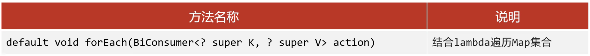
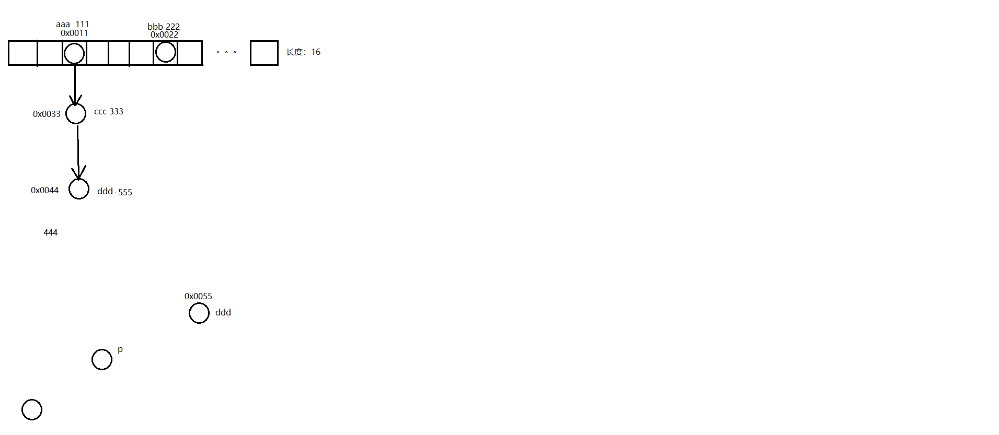

## 1.Map集合

### 1.1Map集合概述和特点【理解】

- Map集合概述

  ```java
  interface Map<K,V>  K：键的类型；V：值的类型
  ```

- Map集合的特点

  - 双列集合,一个键对应一个值
  - 键不可以重复,值可以重复
  - 键和值是一一对应的，每一个键只能找到自己对应的键
  - 键+值这个整体 我们称之“键值对” 或者“键值对对象”，在java中叫做“Entry对象”

- Map集合的基本使用

  ```java
  public class MapDemo01 {
      public static void main(String[] args) {
          //创建集合对象
          Map<String,String> map = new HashMap<String,String>();
  
          //V put(K key, V value) 将指定的值与该映射中的指定键相关联
          map.put("itheima001","林青霞");
          map.put("itheima002","张曼玉");
          map.put("itheima003","王祖贤");
          map.put("itheima003","柳岩");
  
          //输出集合对象
          System.out.println(map);
      }
  }
  ```

### 1.2Map集合的基本功能【应用】

- 方法介绍

  | 方法名                                 | 说明                 |
  | ----------------------------------- | ------------------ |
  | V   put(K key,V   value)            | 添加元素               |
  | V   remove(Object key)              | 根据键删除键值对元素         |
  | void   clear()                      | 移除所有的键值对元素         |
  | boolean containsKey(Object key)     | 判断集合是否包含指定的键       |
  | boolean containsValue(Object value) | 判断集合是否包含指定的值       |
  | boolean isEmpty()                   | 判断集合是否为空           |
  | int size()                          | 集合的长度，也就是集合中键值对的个数 |

- 示例代码

  ```java
  package com.ithieima.map;
  
  import java.util.HashMap;
  import java.util.Map;
  
  public class MapDemo1 {
      public static void main(String[] args) {
          /*
              V put(K key,V value)                添加元素
              V remove(Object key)                根据键删除键值对元素
              void clear()                        移除所有的键值对元素
              boolean containsKey(Object key)     判断集合是否包含指定的键
              boolean containsValue(Object value) 判断集合是否包含指定的值
              boolean isEmpty()                   判断集合是否为空
              int size()                          集合的长度，也就是集合中键值对的个数
  
           */
  
          //1.创建Map集合的对象
          Map<String, String> m = new HashMap<>();
  
          //2.添加元素
          //put方法的细节:
          //添加/覆盖
  
          //在添加数据的时候,如果键不存在,那么直接把键值对对象添加到Map集合当中,方法返回null
          //在添加数据的时候,如果键存在的,那么会把原有的键值对对象覆盖,会把被覆盖的值进行返回
  
          m.put("郭靖", "黄蓉");
          m.put("韦小宝", "沐剑屏");
          m.put("尹志平", "小龙女");
  
          //String value2 = m.put("韦小宝", "双儿");
          //System.out.println(value2);
  
          //删除
          //String result = m.remove("郭靖");//黄蓉
          //System.out.println(result);
  
          //清空
          //m.clear();
  
          //判断是否包含
          boolean keyResult = m.containsKey("郭靖");
          //System.out.println(keyResult);//true
  
          boolean valueResult = m.containsValue("小龙女");
          //System.out.println(valueResult);//true
  
          boolean result = m.isEmpty();
          //System.out.println(result);
  
          int size = m.size();
          System.out.println(size);
  
          //3.打印集合
          System.out.println(m);
      }
  }
  
  ```

### 1.3Map集合的获取功能【应用】

- 方法介绍

  | 方法名                              | 说明           |
  | -------------------------------- | ------------ |
  | V   get(Object key)              | 根据键获取值       |
  | Set<K>   keySet()                | 获取所有键的集合     |
  | Collection<V>   values()         | 获取所有值的集合     |
  | Set<Map.Entry<K,V>>   entrySet() | 获取所有键值对对象的集合 |

- 示例代码

  ```java
  public class MapDemo03 {
      public static void main(String[] args) {
          //创建集合对象
          Map<String, String> map = new HashMap<String, String>();
  
          //添加元素
          map.put("张无忌", "赵敏");
          map.put("郭靖", "黄蓉");
          map.put("杨过", "小龙女");
  
          //V get(Object key):根据键获取值
  //        System.out.println(map.get("张无忌"));
  //        System.out.println(map.get("张三丰"));
  
          //Set<K> keySet():获取所有键的集合
  //        Set<String> keySet = map.keySet();
  //        for(String key : keySet) {
  //            System.out.println(key);
  //        }
  
          //Collection<V> values():获取所有值的集合
          Collection<String> values = map.values();
          for(String value : values) {
              System.out.println(value);
          }
      }
  }
  ```

### 1.4Map集合的遍历(方式1)【应用】

- 遍历思路

  - 我们刚才存储的元素都是成对出现的，所以我们把Map看成是一个夫妻对的集合
    - 把所有的丈夫给集中起来
    - 遍历丈夫的集合，获取到每一个丈夫
    - 根据丈夫去找对应的妻子

- 步骤分析

  - 获取所有键的集合。用keySet()方法实现
  - 遍历键的集合，获取到每一个键。用增强for实现  
  - 根据键去找值。用get(Object key)方法实现

- 代码实现

  ```java
  package com.ithieima.map;
  
  import java.util.HashMap;
  import java.util.Map;
  import java.util.Set;
  
  public class MapDemo2 {
      public static void main(String[] args) {
          //Map集合的第一种遍历方式
  
  
          //1.创建Map集合对象
          Map<String, String> map = new HashMap<>();
  
          //2.添加元素
          map.put("尹志平", "小龙女");
          map.put("郭靖", "穆念慈");
          map.put("欧阳克", "黄蓉");
  
          //3.通过键找值
          //3.1 获取所有的键,把这些键放到一个单列集合当中
          Set<String> keys = map.keySet();
  
          //三个课堂练习:
          //1.利用键找值的方式遍历map集合,要求:装着键的单列集合使用增强for的形式进行遍历
          //3.2 遍历单列集合,得到每一个键
          /*for (String key : keys) {
              //System.out.println(key);
              //3.3 利用map集合中的键获取对应的值 get
              String value = map.get(key);
              System.out.println(key + " = " + value);
          }*/
  
          //2.利用键找值的方式遍历map集合,要求:装着键的单列集合使用迭代器的形式进行遍历
          /*Iterator<String> it = keys.iterator();
          while (it.hasNext()){
              String key = it.next();
              String value = map.get(key);
              System.out.println(key + " = " + value);
          }*/
  
          //3.利用键找值的方式遍历map集合,要求:装着键的单列集合使用lambda表达式的形式进行遍历
          keys.forEach(key -> {
                      String value = map.get(key);
                      System.out.println(key + " = " + value);
                  }
          );
      }
  }
  
  ```

### 1.5Map集合的遍历(方式2)【应用】

- 遍历思路

  - 我们刚才存储的元素都是成对出现的，所以我们把Map看成是一个夫妻对的集合
    - 获取所有结婚证的集合
    - 遍历结婚证的集合，得到每一个结婚证
    - 根据结婚证获取丈夫和妻子

- 步骤分析

  - 获取所有键值对对象的集合
    - Set<Map.Entry<K,V>> entrySet()：获取所有键值对对象的集合
  - 遍历键值对对象的集合，得到每一个键值对对象
    - 用增强for实现，得到每一个Map.Entry
  - 根据键值对对象获取键和值
    - 用getKey()得到键
    - 用getValue()得到值

- 代码实现

  ```java
  package com.ithieima.map;
  
  import java.util.HashMap;
  import java.util.Map;
  
  public class MapDemo3 {
      public static void main(String[] args) {
          //Map集合的第二种遍历方式
          //1.创建集合对象
          Map<String,String> map = new HashMap<>();
  
          //三个课堂练习:
          //1.利用键找值的方式遍历map集合,要求:装着键值对对象的单列集合使用增强for的形式进行遍历
          //2.利用键找值的方式遍历map集合,要求:装着键值对对象的单列集合使用迭代器的形式进行遍历
          //3.利用键找值的方式遍历map集合,要求:装着键值对对象的单列集合使用lambda表达式的形式进行遍历
  
          //2.添加元素
          //键:人物的外号
          //值:人物的姓名
          map.put("标枪选手","马超");
          map.put("人物挂件","明世隐");
          map.put("御龙骑士","尹志平");
  
          //3.Map集合的第二种遍历方式
          //通过键值对对象进行遍历
          //3.1 通过第一个方法获取所有的键值对对象,返回一个Set集合 
          //Set<Map.Entry<String, String>> entries = map.entrySet();
          //3.2遍历entries这个集合,去得到里面的每个键值对对象
  
          //三个课堂练习:
          //1.利用键找值的方式遍历map集合,要求:装着键值对对象的单列集合使用增强for的形式进行遍历
          /*for (Map.Entry<String, String> entry : entries) {
              //3.3 利用entry调用get方法获取键和值
              String key = entry.getKey();
              String value = entry.getValue();
              System.out.println(key + " = " + value);
          }*/
  
          //2.利用键找值的方式遍历map集合,要求:装着键值对对象的单列集合使用迭代器的形式进行遍历
          /*Iterator<Map.Entry<String, String>> it = entries.iterator();
          while (it.hasNext()){
              Map.Entry<String, String> entry = it.next();
              String key = entry.getKey();
              String value = entry.getValue();
              System.out.println(key + " = " + value);
          }*/
  
          //3.利用键找值的方式遍历map集合,要求:装着键值对对象的单列集合使用lambda表达式的形式进行遍历
          /*entries.forEach(new Consumer<Map.Entry<String, String>>() {
              @Override
              public void accept(Map.Entry<String, String> entry) {
                  String key = entry.getKey();
                  String value = entry.getValue();
                  System.out.println(key + " = " + value);
              }
          });*/
  
  
          for (Map.Entry<String, String> entry : map.entrySet()) {
              //3.3 利用entry调用get方法获取键和值
              String key = entry.getKey();
              String value = entry.getValue();
              System.out.println(key + " = " + value);
          }
      }
  }
  
  ```
  
### 1.6Map集合的遍历(方式3)【应用】



- 代码实现

  ~~~java
  package com.ithieima.map;
  
  import java.util.HashMap;
  import java.util.Map;
  import java.util.function.BiConsumer;
  
  public class MapDemo4 {
      public static void main(String[] args) {
          //Map集合的第三种遍历方式
  
          //1.创建Map集合的对象
          Map<String, String> map = new HashMap<>();
  
          //2.添加元素
          //键:人物名字
          //值:名人名言
  
          map.put("鲁迅", "这句话是我说的");
          map.put("曹操", "不可能绝对不可能");
          map.put("刘备", "接着奏乐接着舞");
          map.put("柯镇恶", "看我眼色行事");
  
          //3.利用lambda表达式进行遍历
          //底层:
          //forEach其实就是利用第二种方式进行遍历,依次得到每一个键和值
          //再调用accept方法
          map.forEach(new BiConsumer<String, String>() {
              @Override
              public void accept(String key, String value) {
                  System.out.println(key + " = " + value);
              }
          });
  
          System.out.println("--------------------");
  
          map.forEach((key, value) -> System.out.println(key + " = " + value));
      }
  }
  
  ~~~
  
  


## 2.HashMap集合

### 2.1HashMap集合概述和特点【理解】

+ HashMap底层是哈希表结构的
+ 依赖hashCode方法和equals方法保证键的唯一
+ 如果键要存储的是自定义对象，需要重写hashCode和equals方法
+ 无序、不重复、无索引

### 2.2HashM ap集合应用案例【应用】

- 案例需求

  - 创建一个HashMap集合，键是学生对象(Student)，值是居住地 (String)。存储多个元素，并遍历。
  - 要求保证键的唯一性：如果学生对象的成员变量值相同，我们就认为是同一个对象

- 代码实现

  学生类

  ```java
  public class Student {
      private String name;
      private int age;
  
      public Student() {
      }
  
      public Student(String name, int age) {
          this.name = name;
          this.age = age;
      }
  
      public String getName() {
          return name;
      }
  
      public void setName(String name) {
          this.name = name;
      }
  
      public int getAge() {
          return age;
      }
  
      public void setAge(int age) {
          this.age = age;
      }
  
      @Override
      public boolean equals(Object o) {
          if (this == o) return true;
          if (o == null || getClass() != o.getClass()) return false;
  
          Student student = (Student) o;
  
          if (age != student.age) return false;
          return name != null ? name.equals(student.name) : student.name == null;
      }
  
      @Override
      public int hashCode() {
          int result = name != null ? name.hashCode() : 0;
          result = 31 * result + age;
          return result;
      }
  }
  ```

  测试类

  ```java
  public class HashMapDemo {
      public static void main(String[] args) {
          //创建HashMap集合对象
          HashMap<Student, String> hm = new HashMap<Student, String>();
  
          //创建学生对象
          Student s1 = new Student("林青霞", 30);
          Student s2 = new Student("张曼玉", 35);
          Student s3 = new Student("王祖贤", 33);
          Student s4 = new Student("王祖贤", 33);
  
          //把学生添加到集合
          hm.put(s1, "西安");
          hm.put(s2, "武汉");
          hm.put(s3, "郑州");
          hm.put(s4, "北京");
  
          //遍历集合
          Set<Student> keySet = hm.keySet();
          for (Student key : keySet) {
              String value = hm.get(key);
              System.out.println(key.getName() + "," + key.getAge() + "," + value);
          }
      }
  }
  ```

```java
package com.ithieima.hashmap;

import java.util.*;

public class HashMapDemo2 {
    public static void main(String[] args) {
        /*
        需求:
            某个班级80名学生,现在需要组成秋游活动,班长提供了四个景点依次是(A,B,C,D),
            每个学生只能选择一个景点,请统计处最终哪个景点想去的人多
         */

        //1.需要先让同学们投票
        //定义一个数组,存储四个景点
        String[] arr = {"A", "B", "C", "D"};

        //利用随机数模拟80个学生的投票,并把投票结果存储起来
        ArrayList<String> list = new ArrayList<>();
        Random r = new Random();
        for (int i = 0; i < 80; i++) {
            int index = r.nextInt(arr.length);
            list.add(arr[index]);
        }

        //2.如果要统计的东西比较多,不方便使用计数器思想
        //我们可以定义Map集合,利用集合进行统计
        HashMap<String, Integer> hm = new HashMap<>();

        //判断当前的景点在map集合当中是否存在
        for (String name : list) {
            if (hm.containsKey(name)) {
                //存在
                //先获取当前景点已经被投票的次数
                int count = hm.get(name);
                //表示当前景点又被投了一次
                count++;
                //把新的次数再次添加到集合当中
                hm.put(name, count);
            } else {
                //不存在
                hm.put(name, 1);
            }
        }
        System.out.println(hm);

        //3.求最大值
        int max = 0;
        Set<Map.Entry<String, Integer>> entries = hm.entrySet();
        for (Map.Entry<String, Integer> entry : entries) {
            int count = entry.getValue();
            if(count > max){
                max = count;
            }
        }
        System.out.println(max);

        //4.判断哪个景点的次数和最大值一样,如果一样,打印出来
        for (Map.Entry<String, Integer> entry : entries) {
            int count = entry.getValue();
            if (count == max){
                System.out.println(entry.getKey());
            }
        }
    }
}

```

### HashMap源码分析

```java
1.看源码之前需要了解的一些内容

Node<K,V>[] table   哈希表结构中数组的名字

DEFAULT_INITIAL_CAPACITY：   数组默认长度16

DEFAULT_LOAD_FACTOR：        默认加载因子0.75


HashMap里面每一个对象包含以下内容：
1.1 链表中的键值对对象
    包含：  
			int hash;         //键的哈希值
            final K key;      //键
            V value;          //值
            Node<K,V> next;   //下一个节点的地址值
			
			
1.2 红黑树中的键值对对象
	包含：
			int hash;         		//键的哈希值
            final K key;      		//键
            V value;         	 	//值
            TreeNode<K,V> parent;  	//父节点的地址值
			TreeNode<K,V> left;		//左子节点的地址值
			TreeNode<K,V> right;	//右子节点的地址值
			boolean red;			//节点的颜色
					


2.添加元素
HashMap<String,Integer> hm = new HashMap<>();
hm.put("aaa" , 111);
hm.put("bbb" , 222);
hm.put("ccc" , 333);
hm.put("ddd" , 444);
hm.put("eee" , 555);

//添加元素的时候至少考虑三种情况：
//2.1数组位置为null
//2.2数组位置不为null，键不重复，挂在下面形成链表或者红黑树
//2.3数组位置不为null，键重复，元素覆盖


//参数一：键
//参数二：值

//返回值：被覆盖元素的值，如果没有覆盖，返回null
public V put(K key, V value) {
    return putVal(hash(key), key, value, false, true);
}


//利用键计算出对应的哈希值，再把哈希值进行一些额外的处理
//简单理解：返回值就是返回键的哈希值
static final int hash(Object key) {
    int h;
    return (key == null) ? 0 : (h = key.hashCode()) ^ (h >>> 16);
}

//参数一：键的哈希值
//参数二：键
//参数三：值
//参数四：如果键重复了是否保留
//		   true，表示老元素的值保留，不会覆盖
//		   false，表示老元素的值不保留，会进行覆盖
final V putVal(int hash, K key, V value, boolean onlyIfAbsent,boolean evict) {
	    //定义一个局部变量，用来记录哈希表中数组的地址值。
        Node<K,V>[] tab;
		
		//临时的第三方变量，用来记录键值对对象的地址值
        Node<K,V> p;
        
		//表示当前数组的长度
		int n;
		
		//表示索引
        int i;
		
		//把哈希表中数组的地址值，赋值给局部变量tab
		tab = table;

        if (tab == null || (n = tab.length) == 0){
			//1.如果当前是第一次添加数据，底层会创建一个默认长度为16，加载因子为0.75的数组
			//2.如果不是第一次添加数据，会看数组中的元素是否达到了扩容的条件
			//如果没有达到扩容条件，底层不会做任何操作
			//如果达到了扩容条件，底层会把数组扩容为原先的两倍，并把数据全部转移到新的哈希表中
			tab = resize();
			//表示把当前数组的长度赋值给n
            n = tab.length;
        }

		//拿着数组的长度跟键的哈希值进行计算，计算出当前键值对对象，在数组中应存入的位置
		i = (n - 1) & hash;//index
		//获取数组中对应元素的数据
		p = tab[i];
		
		
        if (p == null){
			//底层会创建一个键值对对象，直接放到数组当中
            tab[i] = newNode(hash, key, value, null);
        }else {
            Node<K,V> e;
            K k;
			
			//等号的左边：数组中键值对的哈希值
			//等号的右边：当前要添加键值对的哈希值
			//如果键不一样，此时返回false
			//如果键一样，返回true
			boolean b1 = p.hash == hash;
			
            if (b1 && ((k = p.key) == key || (key != null && key.equals(k)))){
                e = p;
            } else if (p instanceof TreeNode){
				//判断数组中获取出来的键值对是不是红黑树中的节点
				//如果是，则调用方法putTreeVal，把当前的节点按照红黑树的规则添加到树当中。
                e = ((TreeNode<K,V>)p).putTreeVal(this, tab, hash, key, value);
            } else {
				//如果从数组中获取出来的键值对不是红黑树中的节点
				//表示此时下面挂的是链表
                for (int binCount = 0; ; ++binCount) {
                    if ((e = p.next) == null) {
						//此时就会创建一个新的节点，挂在下面形成链表
                        p.next = newNode(hash, key, value, null);
						//判断当前链表长度是否超过8，如果超过8，就会调用方法treeifyBin
						//treeifyBin方法的底层还会继续判断
						//判断数组的长度是否大于等于64
						//如果同时满足这两个条件，就会把这个链表转成红黑树
                        if (binCount >= TREEIFY_THRESHOLD - 1)
                            treeifyBin(tab, hash);
                        break;
                    }
					//e：			  0x0044  ddd  444
					//要添加的元素： 0x0055   ddd   555
					//如果哈希值一样，就会调用equals方法比较内部的属性值是否相同
                    if (e.hash == hash && ((k = e.key) == key || (key != null && key.equals(k)))){
						 break;
					}

                    p = e;
                }
            }
			
			//如果e为null，表示当前不需要覆盖任何元素
			//如果e不为null，表示当前的键是一样的，值会被覆盖
			//e:0x0044  ddd  555
			//要添加的元素： 0x0055   ddd   555
            if (e != null) {
                V oldValue = e.value;
                if (!onlyIfAbsent || oldValue == null){
					
					//等号的右边：当前要添加的值
					//等号的左边：0x0044的值
					e.value = value;
				}
                afterNodeAccess(e);
                return oldValue;
            }
        }
		
        //threshold：记录的就是数组的长度 * 0.75，哈希表的扩容时机  16 * 0.75 = 12
        if (++size > threshold){
			 resize();
		}
        
		//表示当前没有覆盖任何元素，返回null
        return null;
    }
	
```




## LinkedHashMap

- 由键决定：有序、不重复、无索引
- 这里的有序指的是保证存储和取出的元素顺序一致
- 原理：底层数据结构依然是哈希表，只是每个键值对元素又额外的多了一个双链表的机制记录存储的顺序

```java
package com.ithieima.linkedhashmap;

import java.util.LinkedHashMap;

public class LinkedHashMapDemo1 {
    public static void main(String[] args) {
        /*
        LinkedHashMap:
            由键决定：
                有序、不重复、无索引。
            有序：
                保证存储和取出的顺序一致
            原理：
                底层数据结构是依然哈希表，只是每个键值对元素又额外的多了一个双链表的机制记录存储的顺序。
         */

        //1.创建集合
        LinkedHashMap<String,Integer> lhm = new LinkedHashMap<>();

        //2.添加元素
        lhm.put("a",123);
        lhm.put("a",111);
        lhm.put("b",456);
        lhm.put("c",789);

        //3.打印集合
        System.out.println(lhm);
    }
}

```

## 3.TreeMap集合

### 3.1TreeMap集合概述和特点【理解】

+ TreeMap底层是红黑树结构
+ 由键决定特性:不重复、无索引、可排序
+ 依赖自然排序或者比较器排序,对键进行排序
+ 如果键存储的是自定义对象,需要实现Comparable接口或者在创建TreeMap对象时候给出比较器排序规则

### 3.2TreeMap集合应用案例【应用】

+ 案例需求

  + 创建一个TreeMap集合,键是学生对象(Student),值是籍贯(String),学生属性姓名和年龄,按照年龄进行排序并遍历
  + 要求按照学生的年龄进行排序,如果年龄相同则按照姓名进行排序

+ 代码实现

  学生类

  ```java
  package com.ithieima.treemap;
  
  import java.util.Objects;
  
  public class Student implements Comparable<Student>{
      private String name;
      private int age;
  
      public Student() {
      }
  
      public Student(String name, int age) {
          this.name = name;
          this.age = age;
      }
  
      /**
       * 获取
       * @return name
       */
      public String getName() {
          return name;
      }
  
      /**
       * 设置
       * @param name
       */
      public void setName(String name) {
          this.name = name;
      }
  
      /**
       * 获取
       * @return age
       */
      public int getAge() {
          return age;
      }
  
      /**
       * 设置
       * @param age
       */
      public void setAge(int age) {
          this.age = age;
      }
  
      @Override
      public boolean equals(Object o) {
          if (this == o) return true;
          if (o == null || getClass() != o.getClass()) return false;
          Student student = (Student) o;
          return age == student.age && Objects.equals(name, student.name);
      }
  
      @Override
      public int hashCode() {
          return Objects.hash(name, age);
      }
  
      public String toString() {
          return "Student{name = " + name + ", age = " + age + "}";
      }
  
      @Override
      public int compareTo(Student o) {
          // 要求:按照学生年龄的升序排列,年龄一样按照姓名的字母排列,同姓名年龄视为同一个人
  
          //this:表示当前要添加的元素
          //o:表示已经在红黑树中存在的元素
  
          //返回值:
          //负数:表示当前要添加的元素是小的,存左边
          //正数:表示当前要添加的元素是大的,存右边
          //0:表示当前要添加的元素已经存在,舍弃
          int i = this.getAge() - o.getAge();
          i = i == 0 ? this.getName().compareTo(o.getName()) : i;
          return i;
      }
  }
  
  ```
  
  测试类
  
  ```java
  public class Test1 {
      public static void main(String[] args) {
        	// 创建TreeMap集合对象
          TreeMap<Student,String> tm = new TreeMap<>();
        
  		// 创建学生对象
          Student s1 = new Student("xiaohei",23);
          Student s2 = new Student("dapang",22);
          Student s3 = new Student("xiaomei",22);
        
  		// 将学生对象添加到TreeMap集合中
          tm.put(s1,"江苏");
          tm.put(s2,"北京");
          tm.put(s3,"天津");
        
  		// 遍历TreeMap集合,打印每个学生的信息
          tm.forEach(
                  (Student key, String value)->{
                      System.out.println(key + "---" + value);
                  }
          );
      }
  }
  ```

```java
package com.ithieima.treemap;

import java.util.TreeMap;

public class TreeMapDemo1 {
    public static void main(String[] args) {
        /*
        需求1:
            键:整数表示id
            值:字符串表示商品名称
            要求:按照id的升序排列,按照id的降序排列
         */

        //1.创建集合对象
        //Integer Double 默认请况下都是按照升序排列的
        //String 按照字母在ASCII码表中对应的数字升序进行排列
        //o1:当前要添加的元素
        //o2:表示当前在红黑树中存在的元素
        TreeMap<Integer, String> tm = new TreeMap<>((o1, o2) -> o2 - o1);

        //2.添加元素
        tm.put(1, "粤利粤");
        tm.put(2, "康帅傅");
        tm.put(3, "九个核弹");
        tm.put(4, "雷碧");
        tm.put(5, "可恰可乐");

        System.out.println(tm);

    }

}
```

```java
package com.ithieima.treemap;

import java.util.StringJoiner;
import java.util.TreeMap;

public class TreeMapDemo3 {
    public static void main(String[] args) {
        /*
        需求：字符串"aababcabcdabcde"
            请统计字符串中每一个字符出现的次数，并按照以下格式输出输出结果：
            a (5) b (4) c (3) d (2) e (1)

            分析:
                统计 ---> 计数器思想
                弊端:如果我们要统计的东西比较多,非常的不方便

                新的统计思想:利用map集合进行统计
                HashMap:
                Treemap:
                如果说题目没有要求对结果进行排序,默认使用HashMap
                如果题目中要求对结果进行排序,请使用TreeMap
                键:表示要统计的内容
                值:表示次数

         */

        //1.定义字符串
        String s = "aababcabcdabcde";

        //创建集合
        TreeMap<Character, Integer> tm = new TreeMap<>();

        //2.遍历字符得到里面的每一个字符
        for (int i = 0; i < s.length(); i++) {
            char c = s.charAt(i);
            //拿着c到集合中判断是否存在
            //存在:表示当前集合又一次出现
            //不存在:表示当前字符是第一次出现
            if (tm.containsKey(c)) {
                //存在
                //先把已经出现的次数拿出来
                int count = tm.get(c);
                //当字符又出现了一次
                count++;
                //把自增之后的结果添加到集合当中
                tm.put(c, count);
            } else {
                tm.put(c, 1);
            }

        }

        //4.遍历集合,并按照指定的格式进行拼接
        //a (5) b (4) c (3) d (2) e (1)
        //StringBuilder sb = new StringBuilder();
        //tm.forEach((key, value) -> sb.append(key).append("			(").append(value).append(")"));
        //System.out.println(sb);
        StringJoiner sj = new StringJoiner("","","");
        tm.forEach((key, value) -> sj.add(key + "").add("(").add(value + "").add(")"));
        System.out.println(sj);

    }
}
```

### TreeMap源码分析

```java
1.TreeMap中每一个节点的内部属性
K key;					//键
V value;				//值
Entry<K,V> left;		//左子节点
Entry<K,V> right;		//右子节点
Entry<K,V> parent;		//父节点
boolean color;			//节点的颜色


2.TreeMap类中中要知道的一些成员变量
public class TreeMap<K,V>{
   
    //比较器对象
    private final Comparator<? super K> comparator;

	//根节点
    private transient Entry<K,V> root;

	//集合的长度
    private transient int size = 0;

3.空参构造
	//空参构造就是没有传递比较器对象
	 public TreeMap() {
        comparator = null;
    }
	
4.带参构造
	//带参构造就是传递了比较器对象。
	public TreeMap(Comparator<? super K> comparator) {
        this.comparator = comparator;
    }
		
5.添加元素
	public V put(K key, V value) {
        return put(key, value, true);
    }

参数一：键
参数二：值
参数三：当键重复的时候，是否需要覆盖值
		true：覆盖
		false：不覆盖
		
	private V put(K key, V value, boolean replaceOld) {
		//获取根节点的地址值，赋值给局部变量t
        Entry<K,V> t = root;
		//判断根节点是否为null
		//如果为null，表示当前是第一次添加，会把当前要添加的元素，当做根节点
		//如果不为null，表示当前不是第一次添加，跳过这个判断继续执行下面的代码
        if (t == null) {
			//方法的底层，会创建一个Entry对象，把他当做根节点
            addEntryToEmptyMap(key, value);
			//表示此时没有覆盖任何的元素
            return null;
        }
		//表示两个元素的键比较之后的结果
        int cmp;
		//表示当前要添加节点的父节点
        Entry<K,V> parent;
		
		//表示当前的比较规则
		//如果我们是采取默认的自然排序，那么此时comparator记录的是null，cpr记录的也是null
		//如果我们是采取比较去排序方式，那么此时comparator记录的是就是比较器
        Comparator<? super K> cpr = comparator;
		//表示判断当前是否有比较器对象
		//如果传递了比较器对象，就执行if里面的代码，此时以比较器的规则为准
		//如果没有传递比较器对象，就执行else里面的代码，此时以自然排序的规则为准
        if (cpr != null) {
            do {
                parent = t;
                cmp = cpr.compare(key, t.key);
                if (cmp < 0)
                    t = t.left;
                else if (cmp > 0)
                    t = t.right;
                else {
                    V oldValue = t.value;
                    if (replaceOld || oldValue == null) {
                        t.value = value;
                    }
                    return oldValue;
                }
            } while (t != null);
        } else {
			//把键进行强转，强转成Comparable类型的
			//要求：键必须要实现Comparable接口，如果没有实现这个接口
			//此时在强转的时候，就会报错。
            Comparable<? super K> k = (Comparable<? super K>) key;
            do {
				//把根节点当做当前节点的父节点
                parent = t;
				//调用compareTo方法，比较根节点和当前要添加节点的大小关系
                cmp = k.compareTo(t.key);
				
                if (cmp < 0)
					//如果比较的结果为负数
					//那么继续到根节点的左边去找
                    t = t.left;
                else if (cmp > 0)
					//如果比较的结果为正数
					//那么继续到根节点的右边去找
                    t = t.right;
                else {
					//如果比较的结果为0，会覆盖
                    V oldValue = t.value;
                    if (replaceOld || oldValue == null) {
                        t.value = value;
                    }
                    return oldValue;
                }
            } while (t != null);
        }
		//就会把当前节点按照指定的规则进行添加
        addEntry(key, value, parent, cmp < 0);
        return null;
    }	
	
	
	 private void addEntry(K key, V value, Entry<K, V> parent, boolean addToLeft) {
        Entry<K,V> e = new Entry<>(key, value, parent);
        if (addToLeft)
            parent.left = e;
        else
            parent.right = e;
		//添加完毕之后，需要按照红黑树的规则进行调整
        fixAfterInsertion(e);
        size++;
        modCount++;
    }
	
	private void fixAfterInsertion(Entry<K,V> x) {
		//因为红黑树的节点默认就是红色的
        x.color = RED;

		//按照红黑规则进行调整
		
		//parentOf:获取x的父节点
		//parentOf(parentOf(x)):获取x的爷爷节点
		//leftOf:获取左子节点
        while (x != null && x != root && x.parent.color == RED) {
			
			
			//判断当前节点的父节点是爷爷节点的左子节点还是右子节点
			//目的：为了获取当前节点的叔叔节点
            if (parentOf(x) == leftOf(parentOf(parentOf(x)))) {
				//表示当前节点的父节点是爷爷节点的左子节点
				//那么下面就可以用rightOf获取到当前节点的叔叔节点
                Entry<K,V> y = rightOf(parentOf(parentOf(x)));
                if (colorOf(y) == RED) {
					//叔叔节点为红色的处理方案
					
					//把父节点设置为黑色
                    setColor(parentOf(x), BLACK);
					//把叔叔节点设置为黑色
                    setColor(y, BLACK);
					//把爷爷节点设置为红色
                    setColor(parentOf(parentOf(x)), RED);
					
					//把爷爷节点设置为当前节点
                    x = parentOf(parentOf(x));
                } else {
					
					//叔叔节点为黑色的处理方案
					
					
					//表示判断当前节点是否为父节点的右子节点
                    if (x == rightOf(parentOf(x))) {
						
						//表示当前节点是父节点的右子节点
                        x = parentOf(x);
						//左旋
                        rotateLeft(x);
                    }
                    setColor(parentOf(x), BLACK);
                    setColor(parentOf(parentOf(x)), RED);
                    rotateRight(parentOf(parentOf(x)));
                }
            } else {
				//表示当前节点的父节点是爷爷节点的右子节点
				//那么下面就可以用leftOf获取到当前节点的叔叔节点
                Entry<K,V> y = leftOf(parentOf(parentOf(x)));
                if (colorOf(y) == RED) {
                    setColor(parentOf(x), BLACK);
                    setColor(y, BLACK);
                    setColor(parentOf(parentOf(x)), RED);
                    x = parentOf(parentOf(x));
                } else {
                    if (x == leftOf(parentOf(x))) {
                        x = parentOf(x);
                        rotateRight(x);
                    }
                    setColor(parentOf(x), BLACK);
                    setColor(parentOf(parentOf(x)), RED);
                    rotateLeft(parentOf(parentOf(x)));
                }
            }
        }
		
		//把根节点设置为黑色
        root.color = BLACK;
    }
	
	
6.课堂思考问题：
6.1TreeMap添加元素的时候，键是否需要重写hashCode和equals方法？
此时是不需要重写的。


6.2HashMap是哈希表结构的，JDK8开始由数组，链表，红黑树组成的。
既然有红黑树，HashMap的键是否需要实现Compareable接口或者传递比较器对象呢？
不需要的。
因为在HashMap的底层，默认是利用哈希值的大小关系来创建红黑树的


6.3TreeMap和HashMap谁的效率更高？
如果是最坏情况，添加了8个元素，这8个元素形成了链表，此时TreeMap的效率要更高
但是这种情况出现的几率非常的少。
一般而言，还是HashMap的效率要更高。


6.4你觉得在Map集合中，java会提供一个如果键重复了，不会覆盖的put方法呢？
此时putIfAbsent本身不重要。
传递一个思想：
	代码中的逻辑都有两面性，如果我们只知道了其中的A面，而且代码中还发现了有变量可以控制两面性的发生。
	那么该逻辑一定会有B面。
	
	习惯：
		boolean类型的变量控制，一般只有AB两面，因为boolean只有两个值
		int类型的变量控制，一般至少有三面，因为int可以取多个值。
		

6.5三种双列集合，以后如何选择？
	HashMap LinkedHashMap TreeMap
	
	默认：HashMap（效率最高）
	如果要保证存取有序：LinkedHashMap
	如果要进行排序：TreeMap
```

## 4.properties集合

properties是一个双列集合，拥有Map集合所有的特点。

**重点**：有一些特有的方法，可以把集合中的数据，按照键值对的形式写到配置文件当中。也可以把配置文件中的数据，读取到集合当中。

| 方法名称                                               | 说明                                                   |
| ------------------------------------------------------ | ------------------------------------------------------ |
| `public void store(OutputStream out, String comments)` | 把properties集合中的数据以键值对的形式写到本地文件当中 |
| `public void load(InputStream inStream)`               | 读取本地properties文件中的数据读取到properties集合中   |


