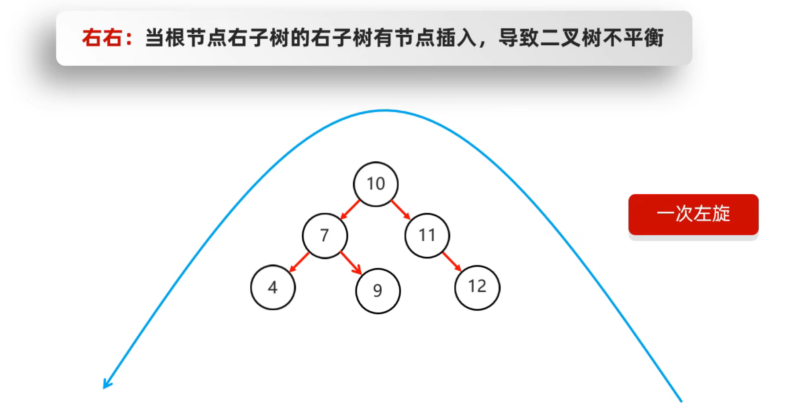
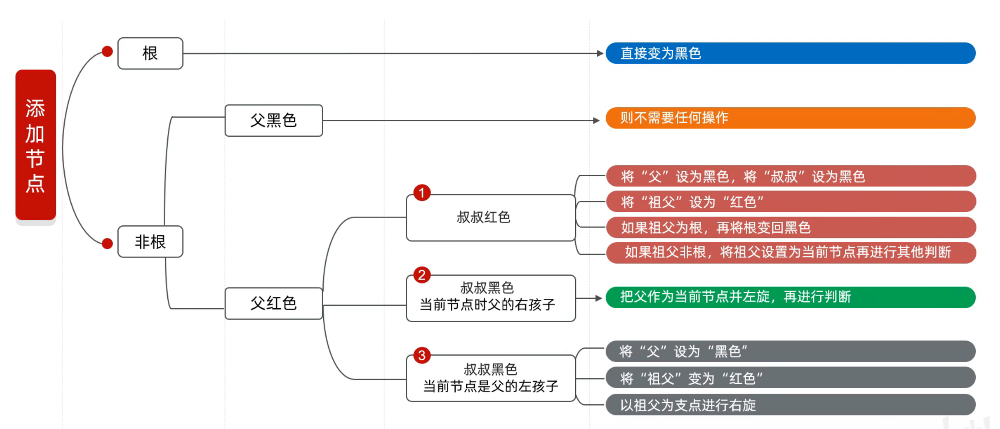

# 数据结构

## 什么是数据结构?

数据结构:计算机存储和组织数据的方式,是指数据相互之间是以什么方式排列在一起的,数据结构是为了更加方便的管理和使用数据,需要结合具体的业务场景来进行选择,一般情况下,精心选择的数据结构可以带来更高的运行或者存储效率

## 常见的数据结构

 ### 栈

   特点:后进先出,先进后出

   数据进入栈模型的过程称为:压/进栈

   数据离开栈模型的过程称为:弹/出栈

   

 ### 队列

   特点:先进先出,后进后出

   数据从==后端==进入队列模型的过程称为:入队列

   数据从==前端==离开队列模型的过程称为:出队列

   

 ### 数组

   数组是一种==查询快==,==删除慢==的模型

   - ==查询速度快:==查询数据通过地址值和索引定位,查询任意数据耗时相同(元素在内存中是连续存储的)
   - ==删除效率低:==要将原始数据删除,同时后面每个数据前移
   - ==添加效率极低==:添加位置后的每一个数据后移,再添加元素

 ### 链表

   链表中的结点是独立的对象,在内存中是不连续的,每一个结点包含数据值和下一个结点的地址值

   

   

   ==**链表查询慢,无论查询哪个数据都要从头开始找**==

   ==**链表增删相对快**==

   

   

   #### 额外扩展

### 树
 #### 二叉树

 #### 二叉查找树

**添加节点规则**:小的存左边,大的存右边,一样的不存

**查找节点**:从根节点开始找,小于从左边找,大于从右边找

##### **遍历方式**:

1. 前序遍历:从根节点开始,按照==当前==节点,==左==子节点,==右==子节点的顺序遍历 

   

2. 中序遍历:从最左边的子节点开始,然后按照==左==子节点,==当前==节点,==右==子节点的顺序遍历

   

3. 后序遍历:从最左边的子节点开始,然后按照==左==子节点,==右==子节点,==当前==节点的顺序遍历

   

4. 层序遍历:从根节点开始一层一层的遍历 

   

   

**弊端**:根节点左子树和右子树可能会不一样长,查询效率低

 #### 平衡二叉树

**规则**:任意节点左右子树高度差不超过1 

**演变**:

##### **旋转机制**

**触发时机**:当添加一个节点之后,该树不是一棵平衡二叉树

**确定节点**:从添加的节点开始,不断的往父节点找不平衡的节点 

**规则1.**左旋

**复杂情况**

**规则2.**右旋 

**复杂情况**

##### **需要旋转的四种情况**: 

1. 左左:当根节点左子树的左子树有节点插入,导致二叉树不平衡,==一次右旋==

   

   

2. 左右:当根节点左子树的右子树有节点插入,导致二叉树不平衡,==仅仅一次右旋还不行==

   

   

   ==**先局部左旋,后整体右旋:**==

   

   

   

   

3. 右右:当根节点右子树的右子树有节点插入,导致二叉树不平衡,==一次左旋==

   

   

4. 右左:当根节点右子树的左子树有节点插入,导致二叉树不平衡,==仅仅一次左旋还不行==

   ==**先局部右旋,再整体左旋**==:

   

   

   

   

 #### 红黑树

- 红黑树是一种自平衡的二叉查找树,是计算机科学中用到的一种数据结构
- 1972年出现,当时被称为平衡二叉B树.后来,1978年被修改为如今的"红黑树".
- 它是一种特殊的二叉查找树,红黑树的每一个节点上都有存储位表示节点的颜色
- ==每一个节点可以是红或者黑==;红黑树==不是高度平衡的==,它的平衡时通过"==红黑规则=="进行实现的
- 是一个二叉查找树
- 但是不是高度平衡的
- 条件:特有的红黑规则

##### **红黑规则**:

1. 每一个节点或是红色,或是黑色
2. 根节点必须是黑色的
3. 如果一个节点没有子节点或者父节点,则该节点相应的指针属性值为Nil,这些Nil视为叶节点,每个叶节点(Nil)是黑色的
4. 如果某一个节点是红色的,那么它的子节点必须是黑色(不能出现两个红色节点相连的情况)
5. 对每一个节点,从该节点到其所有后代叶节点的简单路径上,均包含相同数目的黑色节点 

##### 添加节点规则:

**默认颜色**:添加节点默认是红色的(效率高) 添加三个节点，调整一次

(黑色)添加三个节点,调整两次

**红黑树增删改查的性能都很好** 
