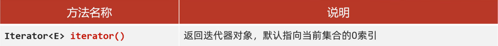
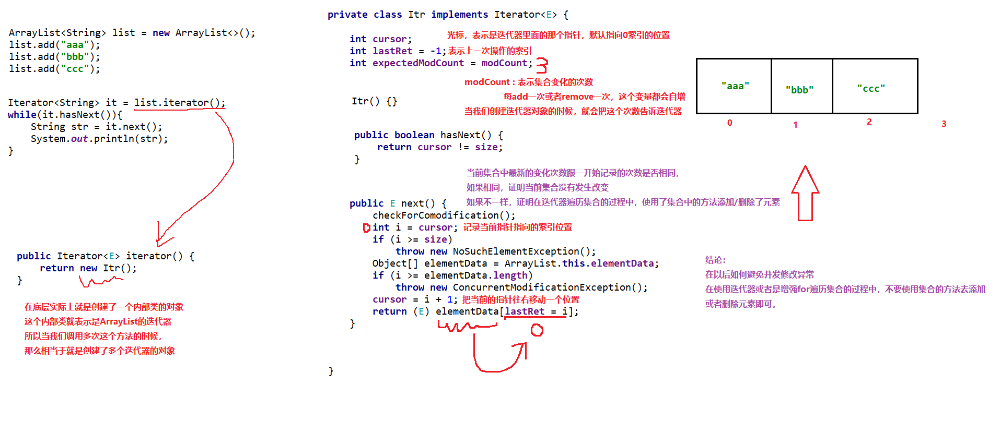

#  集合进阶

## 集合体系结构

> Collection: ==单列集合==

> Map: ==双列集合==


**List系列集合**:添加的元素是有序==(存和取的顺序是一样的)==,可重复的,有索引的

**Set系列集合:**添加的元素是无序,不重复==(可去重)==,无索引的
# 单列集合
## Collection集合

`Collection`是单列集合的祖宗接口,它的功能是全部单列集合都可以继承使用的
### Collection方法

```java
/*
        public boolean add(E e)             添加
        public void clear()                 清空
        public boolean remove(E e)          删除
        public boolean contains(Object obj) 判断是否包含
        public boolean isEmpty()            判断是否为空
        public int size()                   集合长度
        
        注意点:
        Collection是一个接口,我们不能直接创建它的对象
        所以,现在我们学习他的方法时,只能创建它实现类的对象
        实现类:ArrayList
        */

 		//1.添加元素
        //细节1:如果我们要往List系列集合中添加数据,那么方法永远返回true,因为List系列的是允许元素重复的
        //细节2:如果我们要往Set系列集合中添加数据.如果当前要添加的元素不存在,方法返回true,表示添加成功
        //                                  如果当前要添加的元素已经存在,方法返回false,表示添加失败
        //         							因为Set系列的集合不允许重复
		coll.add("aaa");
        coll.add("bbb");
        coll.add("ccc");
        System.out.println(coll);

        //2.清空
        //coll.clear();

        //3.删除
        //细节1:因为Collection中定义的是其共性的方法,所以此时不能通过索引进行删除,只能通过元素的对象进行删除
        //细节2:方法会有一个布尔类型的返回值,删除成功返回true,删除失败返回false
        //如果要删除的元素不存在,就会删除失败
        coll.remove("aaa");
        System.out.println(coll);

        //4.判断元素是否包含
        //细节:底层是依赖equals方法进行判断是否存在的
        //所以,如果集合中存储的是自定义对象(Student),也想通过contains方法进行判断是否包含,那么javaBean类中,一定要重写equals方法
        boolean result = coll.contains("aaa");
        System.out.println(result);

            
            
```

```java
        //1.创建集合的对象
        Collection<Student> coll = new ArrayList<>();

        //2.创建三个学生对象
        Student s1 = new Student("zhangsan",23);
        Student s2 = new Student("lisi",24);
        Student s3 = new Student("wangwu",25);

        //3.把学生对象添加到集合当中
        coll.add(s1);
        coll.add(s2);
        coll.add(s3);

        //4.判断集合中某一个学生对象是否包含
        Student s4 = new Student("zhangsan",23);
        //如果姓名和年龄相同,就认为是同一个学生
        //因为contains方法在底层依赖equals方法判断对象是否一致
        //如果存的是自定义对象,没有重写equals方法,那么默认使用Object类中的equals方法进行判断,而Object类中的equals方法,依赖地址值进行判断
        //需求:如果姓名和年龄相同,就认为是同一个学生.
        //所以,需要在自定义的javaBean类中,重写equals方法
        System.out.println(coll.contains(s4));
```

### Collection的遍历方式

1. 迭代器遍历

   迭代器==不依赖索引==

   迭代器在Java中的类是==Iterator==,迭代器是集合专用的遍历方式

   #### Collection集合获取迭代器

   

   #### Iterator中的常用方法

   

   ```java
   Iterator<String> it = list.iterator();	//创建指针
   while(it.hasNext()){	//判断是否有元素
       String str = it.next();		//获取元素 移动指针
       System.out.println(str);	
   }
   ```

   ```java
   package com.itheima.collection;
   
   import java.util.ArrayList;
   import java.util.Collection;
   import java.util.Iterator;
   
   public class CollectionDemo4 {
       public static void main(String[] args) {
           /*
              细节注意:
               1.报错NoSuchElementException
               2.迭代器遍历完毕,指针不会复位
               3.循环中只能用一次next方法
               4.迭代器遍历时,不能用集合的方法进行增加和删除
            */
   
           //1.创建集合并添加元素
           Collection<String> coll = new ArrayList<>();
           coll.add("aaa");
           coll.add("bbb");
           coll.add("ccc");
           coll.add("ddd");
   
           //2.获取迭代器对象
           //迭代器就好比是一个箭头,默认指向集合的0索引处
           Iterator<String> it = coll.iterator();
           //3.利用循环不断的去获取集合中的每一个元素
           while (it.hasNext()){
               //4.next方法的两件事,获取元素并移动指针
               String next = it.next();
               System.out.println(next);
           }
   
           //当上面循环结束之后,迭代器的指针已经指向了最后没有元素的位置
           //System.out.println(it.next());//NoSuchElementException
   
           //迭代器遍历完毕,指针不会复位
           System.out.println(it.hasNext());
   
           //如果我们要继续第二次遍历集合,只能再次获取一个新的迭代器对象
           Iterator<String> it2 = coll.iterator();
           while (it2.hasNext()){
               String str = it2.next();
               System.out.println(str);
           }
   
       }
   }
   ```

   ```java
   package com.itheima.collection;
   
   import java.util.ArrayList;
   import java.util.Collection;
   import java.util.Iterator;
   
   public class CollectionDemo5 {
       public static void main(String[] args) {
           /*
               细节注意:
               1.报错NoSuchElementException
               2.迭代器遍历完毕,指针不会复位
               3.循环中只能用一次next方法
               4.迭代器遍历时,不能用集合的方法进行增加和删除
            */
   
           //1.创建集合并添加元素
           Collection<String> coll = new ArrayList<>();
           coll.add("aaa");
           coll.add("bbb");
           coll.add("ccc");
           coll.add("ddd");
           coll.add("eee");
   
           //2.获取迭代器对象
           //迭代器就好比是一个箭头,默认指向集合的0索引处
           Iterator<String> it = coll.iterator();
           //3.利用循环不断的去获取集合中的每一个元素
           while (it.hasNext()){
               //4.next方法的两件事,获取元素并移动指针
               String str = it.next();
               if ("bbb".equals(str)){
                  // coll.remove("bbb");
                   it.remove();
               }
           }
           System.out.println(coll);
       }
   }
   ```

   

   ==**细节注意:**==

   1. 报错NoSuchElementException
   2. 迭代器遍历完毕,指针不会复位
   3. 循环中只能用一次next方法
   4. 迭代器遍历时,不能用集合的方法进行增加和删除

    

2. 增强for遍历

   - 增强for的底层就是迭代器,为了简化迭代器的代码书写
   - 它是JDK5之后出现的,其内部原理就是一个Iterator迭代器
   - 所有的单列集合和数组才能用增强for进行遍历

   

   ```java
   package com.itheima.collection;
   
   import java.util.ArrayList;
   import java.util.Collection;
   
   public class CollectionDemo6 {
       public static void main(String[] args) {
           /*
           Collection系列集合三种通用的遍历方式:
           1.迭代器遍历
           2.增强for遍历
           3.lambda表达式遍历
   
           增强for格式:
               for(数据类型 变量名:集合/数组){
   
               }
   
           快速生成方式:
               集合的名字 + for 回车
            */
   
           //1.创建集合名添加元素:
           Collection<String> coll = new ArrayList<>();
           coll.add("zhangsan");
           coll.add("lisi");
           coll.add("wangwu");
   
           //2.利用增强for进行遍历
           //注意点:
           //s其实就是一个第三方变量,在循环的过程中依次表示集合中的每一个数据
           /*for (String s : coll){
               System.out.println(s);
           }*/
   
           for (String s : coll) {
               s = "p";
               System.out.println(s);
           }
           System.out.println(coll);
       }
   }
   ```

   ==**增强for循环细节**==:修改增强for中的变量,不会改变集合中原本的数据

   

3. Lambda表达式遍历

   
   
   ```java
   package com.itheima.collection;
   
   import java.util.ArrayList;
   import java.util.Collection;
   
   public class CollectionDemo7 {
       public static void main(String[] args) {
           /*
           Collection系列集合三种通用的遍历方式:
           1.迭代器遍历
           2.增强for遍历
           3.lambda表达式遍历
   
           lambda表达式遍历:
                   default void forEach(Consumer<? super T> action):
            */
   
   
           //1.创建集合名添加元素:
           Collection<String> coll = new ArrayList<>();
           coll.add("zhangsan");
           coll.add("lisi");
           coll.add("wangwu");
   
           //2.利用匿名内部类的形式
           //底层原理:
           //其实也会自己遍历集合,依次得到每一个元素
           //把得到的每一个元素,传递给下面的accept方法
           //s依次表示集合中的每一个数据
           /*coll.forEach(new Consumer<String>() {
               @Override
               //s依次表示集合中的每一个数据
               public void accept(String s) {
                   System.out.println(s);
               }
           });*/
   
           //2.利用lambda表达式遍历
           //() -> {}
           coll.forEach(s -> System.out.println(s)
           );
       }
   }
   ```

### 总结


## List集合

### List集合的特点

- 有序:存和取的元素顺序一致
- 有索引:可以通过索引操作元素
- 可重复:存储的元素可以重复  

### List集合的特有方法

- Collection的方法List都继承了
- List集合因为有索引,所以多了很多操作索引的方法


```java
package com.itheima.list;

import java.util.ArrayList;
import java.util.List;

public class ListDemo1 {
    public static void main(String[] args) {
        /*

        List系列集合独有的方法:
            void add(int index,E element)       在此集合中的指定位置插入指定的元素
            E remove(int index)                 删除指定索引处的元素,返回被删除的元素
            E set(int index,E element)          修改指定索引处的元素,返回被修改的元素
            E get(int index)                    返回指定索引处的元素
         */

        //1.创建一个集合
        List<String> list = new ArrayList<>();

        //2.添加元素
        list.add("aaa");
        list.add("bbb");
        list.add("ccc");

        // void add(int index,E element)       在此集合中的指定位置插入指定的元素
        //细节:原来索引上的元素会依次往后移
        //list.add(1,"QQQ");

        // E remove(int index)                 删除指定索引处的元素,返回被删除的元素
        //String remove = list.remove(0);
        //System.out.println(remove);

        //E set(int index,E element)          修改指定索引处的元素,返回被修改的元素
        String result = list.set(0, "qqq");
        System.out.println(result);

        // E get(int index)                    返回指定索引处的元素
        String s = list.get(0);
        System.out.println(s);


        //3.打印集合
        System.out.println(list);


    }
}

```

```java
		//List系列集合中的两个删除方法
        //1.直接删除元素
        //2.通过索引进行删除

        //1.创建集合并添加元素 1 2 3 4
        List<Integer> list = new ArrayList<>();
        list.add(1);
        list.add(2);
        list.add(3);

        //2.删除元素
        //请问:此时删除的是1这个元素,还是1索引上的元素
        //为什么?
        //因为在调用方法的时候,如果方法出现了重载现象
        //优先调用,实参跟形参类型一致的那个方法

        //此时remove方法是不会自动装箱的(结论)
        //list.remove(1);

        //手动装箱,手动把基本数据类型的1,变成Integer类型
        Integer i = Integer.valueOf(1);
        list.remove(i);

        System.out.println(list);
```

### List集合五种遍历方式对比

```java
 		/*
       List集合的遍历方式:
            1. 迭代器遍历
            2. 列表迭代器遍历
            3. 增强for遍历
            4. lambda表达式遍历
            5. 不同for循环遍历(因为List集合存在索引)
         */

        //创建集合并添加元素
        List<String> list = new ArrayList<>();
        list.add("aaa");
        list.add("bbb");
        list.add("ccc");

        /*//1.迭代器
        Iterator<String> it = list.iterator();
        while (it.hasNext()){
            String s = it.next();
            System.out.println(s);
        }*/

        //2.增强for
        //下面的变量s,其实就是一个第三方变量而已
        //在循环的过程中,依次表示集合中的每一个元素
        /*for (String s : list) {
            System.out.println(s);
        }*/

        //3. lambda表达式遍历
        //forEach方法的底层就是一个循环遍历,依次得到集合中的每一个元素
        //并把每一个元素传递给下面的accept方法
        //accept方法的形参s,依次表示集合中的每一个元素
        //list.forEach(s -> System.out.println(s));

        //4.普通for循环
        //size方法跟get方法还有循环结合的方式,利用索引获取到集合中的每一个元素
        /*for (int i = 0; i < list.size(); i++) {
            //i:依次表示集合中的每一个索引
            String s = list.get(i);
            System.out.println(s);
        }*/

        //5.列表迭代器遍历
        //获取一个列表迭代器对象,里面的指针默认也是指向0索引的

        //额外添加了一个方法:在遍历的过程中,可以添加元素
        ListIterator<String> it = list.listIterator();
        while (it.hasNext()){
            String s = it.next();
            if ("bbb".equals(s)){
                it.add("qqq");
            }
            System.out.println(s);
        }
        System.out.println(list);
```


## ArrayList集合

### ArrayList集合底层原理

1. 利用空参创建的集合,在底层创建一个默认长度为0的数组
2. ==添加第一个元素的时候==,底层会创建一个新的长度为10的数组
3. 存满时,会扩容1.5倍
4. 如果一次添加多个元素,1.5倍还放不下,则新创建的数组以实际长度为准


## LinkedList集合

- 底层数据结构是双链表,查询慢,增删快,但是如果操作的是首尾元素,速度也是极快的
- LinkedList本身多了很多直接操作首尾元素的特有API


### LinkedList特有方法


### LinkedList底层原理


##     迭代器源码分析



## 泛型深入

**泛型**:是JDK5中引入的特性,可以在编译阶段约束操作的数据类型,并进行检查

**泛型的格式**:<数据类型>

**注意**:泛型只能支持引用数据类型

### 泛型的好处:

- 统一数据类型
- 把运行时期的问题提前到了编译期间 避免了强制类型转换可能出现的异常,因为在编译阶段类型就能确定下来

==扩展知识点:Java中的泛型是伪泛型==


### 泛型的细节:

- 泛型中不能写基本数据类型
- 指定泛型的具体类型后,传递数据时,可以传入该类类型或者其子类类型
- 如果不写泛型,类型默认是Object

### 泛型类

**使用场景**:当一个类中,某个变量的数据类型不确定时,就可以定义带有泛型的类


```java
public class MyArrayList<E> {
    /*
    当我在编写一个类的时候,如果不确定类型,那么这个类就可以定义为泛型类
 */
    Object[] obj = new Object[10];
    int size;

    //E : 表示不确定的类型,该类型在类名后面已经定义过了
    //e : 形参的名字,变量名
    public boolean add(E e) {
        obj[size] = e;
        size++;
        return true;
    }

    public E get(int index) {
        return (E) obj[index];
    }

    @Override
    public String toString() {
        return Arrays.toString(obj);
    }
}

```


### 泛型方法

**方法中形参类型不确定时**:

- 方案1:使用类名后面定义的泛型:==所有方法都能用==
- 方案2:在方法申明上定义自己的泛型:==只有本方法能用==


```java
package com.itheima.generics;

import java.util.ArrayList;

public class ListUtil {

    //类中定义一个静态方法addAll,用来添加多个集合的元素

    //参数一:集合
    //参数二~最后:要添加的元素
    public static<E> void addAll(ArrayList<E> list,E e1,E e2,E e3,E e4){
        list.add(e1);
        list.add(e2);
        list.add(e3);
        list.add(e4);
    }
    public static<E> void addAll(ArrayList<E> list,E...e){
        for (E element : e) {
            list.add(element);
        }
    }

    public void show(){
        System.out.println("尼古拉斯.阿伟");
    }
}
```

```java
package com.itheima.generics;

import java.util.ArrayList;

public class GenericsDemo3 {
    /*
    定义一个工具类:ListUtil
    类中定义一个静态方法addAll,用来添加多个集合的元素
     */
    public static void main(String[] args) {
        ArrayList<String> list1 = new ArrayList<>();
        ListUtil.addAll(list1,"aaa","bbb","ccc","ddd");
        System.out.println(list1);

        ArrayList<Integer> list2 = new ArrayList<>();
        ListUtil.addAll(list2,1,2,3,4);
        System.out.println(list2);
    }
}

```

### 泛型接口


```java
package com.itheima.generics;

import java.util.Collection;
import java.util.Iterator;
import java.util.List;
import java.util.ListIterator;

//实现类给出具体类型
public class MyArrayList2 implements List<String> {
    
}

```

```java
package com.itheima.generics;

import java.util.Collection;
import java.util.Iterator;
import java.util.List;
import java.util.ListIterator;

//实现类延续泛型，创建对象时再确定
public class MyArrayList3<E> implements List<E> {

}

```

### 泛型的继承和通配符

- 泛型不具备继承性,但是数据具备继承性

```java
		/*
        泛型不具备继承性,但是数据具备继承性
         */

        //创建集合对象
        ArrayList<Ye> list1 = new ArrayList<>();
        ArrayList<Fu> list2 = new ArrayList<>();
        ArrayList<Zi> list3 = new ArrayList<>();

        //调用method方法
        //method(list1);
        //method(list2);
        //method(list3);

        list1.add(new Ye());
        list1.add(new Fu());
        list1.add(new Zi());


    }

    //此时,泛型里面写的是什么类型,那么只能传递什么类型的数据
    public static void method(ArrayList<Ye> list) {

    }

class Ye {
}

class Fu extends Ye {
}

class Zi extends Fu {
}
```

```java
 /*
        需求:
            定义一个方法,形参是一个集合,但是集合中的数据类型不确定
         */

        //创建集合对象
        ArrayList<Ye> list1 = new ArrayList<>();
        ArrayList<Fu> list2 = new ArrayList<>();
        ArrayList<Zi> list3 = new ArrayList<>();
        ArrayList<student> list4 = new ArrayList<>();

        //调用method方法
        method1(list1);
        method1(list2);
        method1(list3);
        //method1(list4);


        method2(list1);
        method2(list2);
        //method2(list3);
        //method2(list4);

    }

    //此时,泛型里面写的是什么类型,那么只能传递什么类型的数据
    //弊端:
    //      利用泛型方法有一个小弊端,此时他可以接受任意的数据类型
    //        Ye  Fu  Zi    Student
    //希望:本方法虽然不确定类型,但是以后我希望只能传递Ye Fu Zi
    //此时我们就可以使用泛型的通配符:
    //                  ?也表示不确定的类型
    //                  他可以表示进行类型的限定
    //                  ? extends E:表示可以传递E或者E所有的子类类型
    //                  ? super E:表示可以传递E或者E所有的父类类型

    //应用场景:
    //      1.如果我们在定义类,方法,接口的时候,如果类型不确定,就可以定义泛型类,泛型方法,泛型接口
    //      2.如果类型不确定,但是能知道以后只能传递某个继承体系中的,就可以使用泛型的通配符
    //泛型的通配符:
    //          关键点:可以限定类型的范围
    public static void method1(ArrayList<? extends Ye> list) {

    }
    public static void method2(ArrayList<? super Fu> list) {

    }
}

class Ye {
}

class Fu extends Ye {
}

class Zi extends Fu {
}

class student{}
```


## Set系列集合 

- 无序:存取顺序不一致
- 不重复:可以去除重复
- 无索引:没有带索引的方法,所以不能使用普通for循环遍历,也不能通过索引来获取元素

==Set接口中的方法基本上与Collection的API一致==

### HashSet

**底层原理**:

- HashSet:无序,不重复,无索引

- HashSet集合底层采取哈希表存储数据

- 哈希表是一种对于增删改查数据性能都较好的结构

  

  **加载因子用于数组扩容,当==存入元素 = 数组长度  \*  0.75==时,那么数组将会扩容两倍**

  **JDK8以后,当链表长度==超过8==,而且数组长度==大于等于64==时,自动转换为红黑树**
  
  **如果集合中存储的是自定义对象,必须要重写hashCode和equals方法**

**哈希表的组成**:

- JDK8之前:数组 + 链表

- JDK8之后:数组 + 链表 + 红黑树

 **哈希值**:对象的整数表现形式

```java
int index = (数组长度 - 1) & 哈希值;
```

- 根据hashCode方法算出来的int类型的整数
- 该方法定义在Object类中,所有对象都可以调用,默认使用地址值进行计算
- 一般情况下,会重写hashCode方法,利用对象内部的属性值计算hashCode

**对象哈希值特点**:

- 如果没有重写hashCode方法,不同对象计算出的hashCode值不同的
- 如果已经重写hashCode方法,不同的对象只要属性值相同,计算出的哈希值就是一样的
- 在小部分情况下,不同的属性值或者不同的地址值计算出来的哈希值也有可能一样(哈希碰撞)

```java
package com.itheima.set;

public class HashSetDemo1 {
    public static void main(String[] args) {
        /*
        哈希值:
            对象的整数表现形式
            1. 如果没有重写hashCode方法,不同对象计算出的hashCode值不同的
            2. 如果已经重写hashCode方法,不同对象只要属性值相同,计算出的哈希值就是一样的
            3. 在小部分情况下,不同的属性值或者不同的地址值计算出来的哈希值也有可能一样(哈希碰撞)
         */

        //1.创建对象
        Student s1 = new Student("zhangsan", 23);
        Student s2 = new Student("zhangsan", 23);

        //2.如果没有重写hashCode方法,不同对象计算出的hashCode值不同的
        //如果已经重写hashCode方法,不同对象只要属性值相同,计算出的哈希值就是一样的
        System.out.println(s1.hashCode());//-1461067292
        System.out.println(s2.hashCode());//-1461067292

        //在小部分情况下,不同的属性值或者不同的地址值计算出来的哈希值也有可能一样
        //(哈希碰撞)
        System.out.println("abc".hashCode());//96354
        System.out.println("acD".hashCode());//96354
    }
}

```

**HashSet的三个问题**:

- 1.HashSet为什么存和取的顺序不一样?

  在遍历集合时是会从0索引开始遍历,如果索引位置存的是null,会接着往下遍历有内容的链表或红黑树,但是遍历的元素不一定是第一个添加的元素,所以存和取的顺序可能不一样.

- 2.HashSet为什么没有索引?

  因为HashSet的底层是由数组 + 链表 + 红黑树组成,不好规定谁是0索引,如果规定数组为0索引,可是它下面挂着链表,不合适.所以取消了HashSet索引机制.

- 3.HashSet是利用什么机制保证数据去重的?

  利用HashCode方法和equals方法,而哈希值就可以确定当前元素添加到数组中哪个位置,然后再调用equals方法比较对象内部的属性值是否相同.

### LinkedHashSet

**LinkedHashSet底层原理**:

- LinkedHashSet:**有序**,不重复,无索引

- 这里的有序指的是保证存储和取出的元素顺序一致

- **原理**:底层数据结构依然是哈希表,只是每个元素又额外的多了一个双链表的机制记录存储的顺序

  

### TreeSet

- TreeSet:可排序,不重复,无索引
- ==可排序==:按照元素默认规则(由小到大)排序
- TreeSet集合底层是基于==红黑树的数据结构==实现排序的,增删改查性能都较好

**默认规则**:

- 对于数值类型:Integer,Double,默认按照从小到大的顺序进行排序
- 对于字符,字符串类型:按照字符在ASCII码表中的数字升序进行排序

**两种比较规则**:

- 方式1:

  ==默认排序/自然排序==:JavaBean类实现Comparable接口指定比较规则

  ```java
  package com.itheima.set;
  
  import java.util.TreeSet;
  
  public class TreeSetDemo2 {
      public static void main(String[] args) {
          /*
              需求:创建TreeSet集合,并添加3个学生对象
              学生对象属性:
                  姓名,年龄
                  按照学生的年龄进行排序
                  同年龄按照姓名字母排列(暂不考虑中文)
                  同姓名,同年龄认为是同一个人
  
              方式1:
                  默认的排序规则/自然排序
                  Student实现Comparable接口,重写里面的抽象方法,再指定比较规则
           */
  
          //1.创建三个学生对象
          Student s1 = new Student("zhangsan",23);
          Student s2 = new Student("lisi",24);
          Student s3 = new Student("wangwu",25);
          Student s4 = new Student("zhaoliu",26);
  
          //2.创建集合对象
          TreeSet<Student> ts = new TreeSet<>();
  
          //3.添加元素
          ts.add(s1);
          ts.add(s2);
          ts.add(s3);
          ts.add(s4);
  
          //4.打印集合
          System.out.println(ts);
  
          //hashCode和equals方法:哈希表有关
          //TreeSet底层是红黑树
      }
  }
  ```

  ```java
  package com.itheima.set;
  
  public class Student implements Comparable<Student>{
      private String name;
      private int age;
  
      public Student() {
      }
  
      public Student(String name, int age) {
          this.name = name;
          this.age = age;
      }
  
      /**
       * 获取
       * @return name
       */
      public String getName() {
          return name;
      }
  
      /**
       * 设置
       * @param name
       */
      public void setName(String name) {
          this.name = name;
      }
  
      /**
       * 获取
       * @return age
       */
      public int getAge() {
          return age;
      }
  
      /**
       * 设置
       * @param age
       */
      public void setAge(int age) {
          this.age = age;
      }
  
      public String toString() {
          return "Student{name = " + name + ", age = " + age + "}";
      }
  
      @Override
      //this:表示当前要添加的元素
      //o:表示已经在红黑树存在的元素
  
      //返回值:
      //负数:表示当前要添加的元素是小的,存左边
      //正数:表示当前要添加的元素是大的,存右边
      //0:表示当前要添加的元素已经存在,舍弃
      public int compareTo(Student o) {
          System.out.println("----------");
          System.out.println("this:" + this);
          System.out.println("o:" + o);
          //指定排序规则
          //只看年龄,我想要按照年龄的升序进行排序
          return this.getAge() - o.getAge();
      }
  }
  
  ```

  

  

- 方法2:

  ==比较器排序==:创建TreeSet对象时候,传递比较强Comparator指定规则

  ==使用规则:==默认使用第一种,如果第一种不能满足当前需求,就使用第二种

  ```java
   		/*
          需求:请自行选择比较器排序和自然排序两种方式:
          要求:存在四个字符串,"c","ab","df","qwer"
          按照长度排序,如果一样长则按照首字母排序
  
          采取第二种排序方式:比较器排序
           */
  
          //1.创建集合
          //o1:表示当前要添加的元素
          //o2:表示已经在红黑树存在的元素
  
          //返回值规则跟之前一样
          TreeSet<String> ts = new TreeSet<>((o1, o2) -> {
              //按照长度排序
              //如果一样长就按照首字母排序
              int i = o1.length() - o2.length();
              i = i == 0 ? o1.compareTo(o2) : i;
              return i;
          });
  
          //2.添加元素
          ts.add("c");
          ts.add("ab");
          ts.add("df");
          ts.add("qwer");
  
          //3.打印集合
          System.out.println(ts);
  ```

```java
package com.itheima.set;

import java.util.TreeSet;

public class TreeSetDemo4 {
    public static void main(String[] args) {
        /*
            需求：创建5个学生对象
            属性：（姓名，年龄，语文成绩，数学成绩，英语成绩）,
            按照总分从高到低输出到控制台
            如果总分一样，按照语文成绩排
            如果语文一样，按照数学成绩排如果数学成绩一样，按照英语成绩排如果英文成绩一样，按照年龄排如果年龄一样，按照姓名的字母顺序排如果都一样，认为是同一个学生，不存。

            第一种:默认排序/自然排序

            第二种:比较器排序

            默认情况下,用第一种排序,如果第一种不能满足当前需求,采取第二种方式

            课堂练习:
                要求:在遍历集合的时候,我想看到总分
         */

        //1.创建学生对象
        Student2 s1 = new Student2("zhangsan",23,90,99,50);
        Student2 s2 = new Student2("lisi",24,90,98,50);
        Student2 s3 = new Student2("wangwu",25,95,100,30);
        Student2 s4 = new Student2("zhaoliu",26,60,99,70);
        Student2 s5 = new Student2("qianqi",27,70,80,70);

        //2.创建集合
        TreeSet<Student2> ts = new TreeSet<>();

        //3.添加元素
        ts.add(s1);
        ts.add(s2);
        ts.add(s3);
        ts.add(s4);
        ts.add(s5);

        //4.打印集合(遍历)
        //System.out.println(ts);
        for (Student2 t : ts) {
            System.out.println(t);
        }

    }
}

```

```java
package com.itheima.set;

public class Student2 implements Comparable<Student2> {
    // 属性：（姓名，年龄，语文成绩，数学成绩，英语成绩）,
    private String name;
    private int age;
    private int chinese;
    private int math;
    private int english;


    public Student2() {
    }

    public Student2(String name, int age, int chinese, int math, int english) {
        this.name = name;
        this.age = age;
        this.chinese = chinese;
        this.math = math;
        this.english = english;
    }

    /**
     * 获取
     *
     * @return name
     */
    public String getName() {
        return name;
    }

    /**
     * 设置
     *
     * @param name
     */
    public void setName(String name) {
        this.name = name;
    }

    /**
     * 获取
     *
     * @return age
     */
    public int getAge() {
        return age;
    }

    /**
     * 设置
     *
     * @param age
     */
    public void setAge(int age) {
        this.age = age;
    }

    /**
     * 获取
     *
     * @return chinese
     */
    public int getChinese() {
        return chinese;
    }

    /**
     * 设置
     *
     * @param chinese
     */
    public void setChinese(int chinese) {
        this.chinese = chinese;
    }

    /**
     * 获取
     *
     * @return math
     */
    public int getMath() {
        return math;
    }

    /**
     * 设置
     *
     * @param math
     */
    public void setMath(int math) {
        this.math = math;
    }

    /**
     * 获取
     *
     * @return english
     */
    public int getEnglish() {
        return english;
    }

    /**
     * 设置
     *
     * @param english
     */
    public void setEnglish(int english) {
        this.english = english;
    }

    public String toString() {
        return "Student2{name = " + name + ", age = " + age + ", chinese = " + chinese + ", math = " + math + ", english = " + english + ", sum = " + (chinese + math + english) +"}";
    }

    /* 按照总分从高到低输出到控制台
     如果总分一样，按照语文成绩排
     如果语文一样，按照数学成绩排
     如果数学成绩一样，按照英语成绩排
     如果英文成绩一样，按照年龄排
     如果年龄一样，按照姓名的字母顺序排
     如果都一样，认为是同一个学生，不存。*/
    @Override
    public int compareTo(Student2 o) {
        //比较两者的总分
        int sum1 = this.getChinese() + this.getMath() + this.getEnglish();
        int sum2 = o.getChinese() + o.getMath() + o.getEnglish();
        //如果总分一样，按照语文成绩排
        int i = sum1 - sum2;
        i = i == 0 ? this.getChinese() - o.getChinese() : i;
        //如果语文一样，按照数学成绩排
        i = i == 0 ? this.getMath() - o.getMath() : i;
        //如果数学成绩一样，按照英语成绩排(可以忽略不写)
        //i = i == 0 ? this.getEnglish() - o.getEnglish() : i;
        //如果英文成绩一样，按照年龄排
        i = i == 0 ? this.getAge() - o.getAge() : i;
        //如果年龄一样，按照姓名的字母顺序排
        i = i == 0 ? this.getName().compareTo(o.getName()) : i;
        //如果都一样，认为是同一个学生，不存
        return i;
    }
}

```

## 总结

1. 如果想要集合中的元素可重复
   - **用ArrayList集合,基于数组**==(用的最多)==
2. 如果想要集合中的元素可重复,而且当前的==增删操作明显多于查询==
   - **用LinkedList集合,基于链表**
3. 如果想对集合中的元素去重
   - **用HashSet集合,基于哈希表**==(用的最多)==
4. 如果想对集合中的元素去重,而且==保证存取顺序==
   - **用LinkedHashSet集合,基于哈希表和双链表,效率低于HashSet**
5. 如果想对集合中的元素进行==排序==
   - **用TreeSet集合,基于红黑树,后续也可以用List集合实现排序**

# 双列集合

## 双列集合特点 

1. 双列集合一次需要存一对数据,分别为键和值
2. 键不能重复,值可以重复
3. 键和值使一一对应的,每一个键只能找到自己对应的值
4. 键 + 值这个整体 我们称之为"键值对"或者"键值对对象",在Java中叫做"Entry对象"


