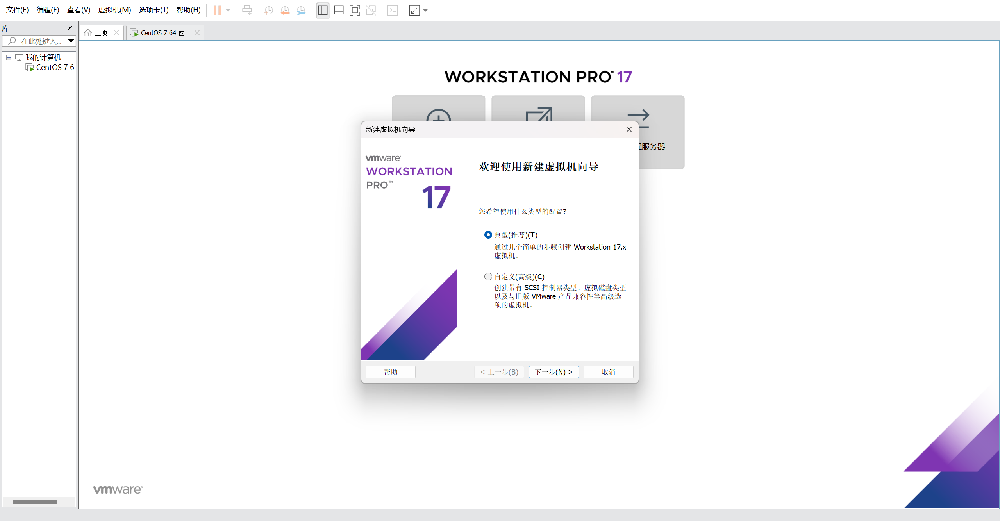
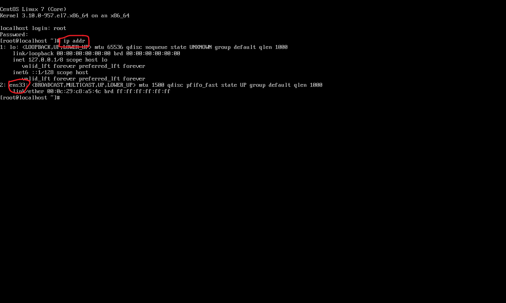
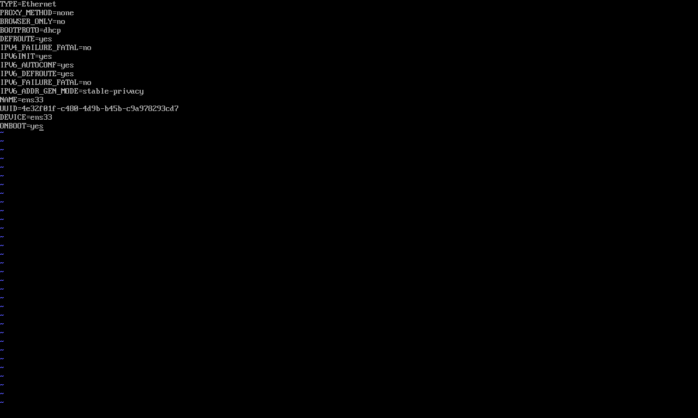
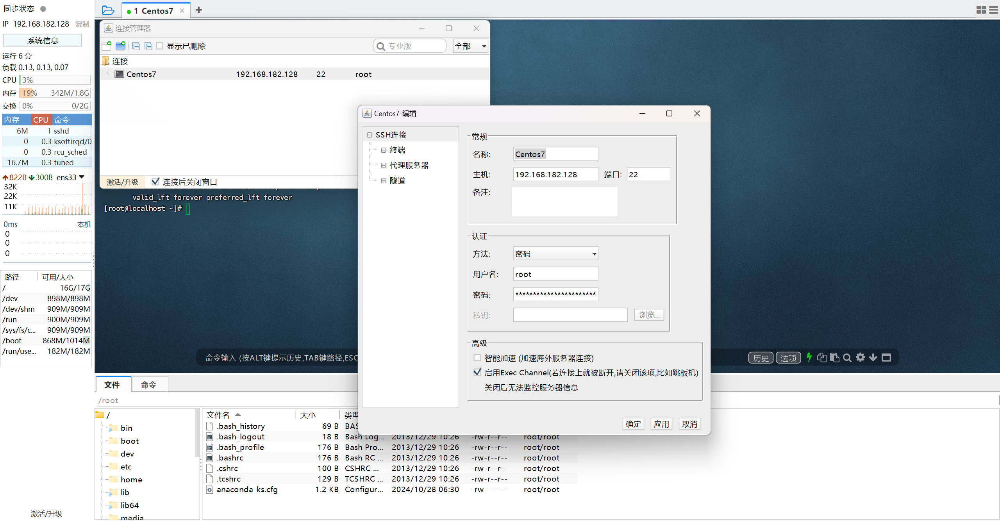

## Linux安装

**安装方式介绍**

物理机安装：直接将操作系统安装到服务器硬件上

虚拟机安装：通过虚拟机软件安装

**安装Linux**



**网卡设置**

由于启动服务器时未加载网卡,导致IP地址初始化失败



修改网络初始化配置,设定网卡在系统启动时初始化

```
cd /				进入根目录
cd etc				进入etc目录
cd sysconfig		进入sysconfig目录
cd network-scripts	进入network-scripts
vi ifcfg-ens33		编辑ifcfg-ens33文件
```



**安装SSH连接工具**



## Linux常用命令

| 命令           | 对应英文             | 作用                    |
| -------------- | -------------------- | ----------------------- |
| ls             | list                 | 查看当前目录下的内容    |
| pwd            | print work directory | 查看当前所在目录        |
| cd [目录名]    | change directory     | 切换目录                |
| touch [文件名] | touch                | 如果文件不存在,新建文件 |
| mkdir [目录名] | make directory       | 创建目录                |
| rm [文件名]    | remove               | 删除指定文件            |

### **Linux命令使用技巧**

- Tab键自动补全

- 连续两次Tab键,给出操作提示

- 使用上下箭头快速调出曾经使用过的命令

- 使用clear命令或Ctrl+l快捷键实现清屏

### **Linux命令格式**

`command [-options] [parameter]`

说明:

- command:命令名

- [-options]:选项,可用来对命令进行控制,也可以省略

- [parameter]:传给命令的参数,可以是零个,一个或多个

注意:

- []代表可选
- 命令名、选项、参数之间有空格进行分割

**文件目录操作命令==ls==**

作用：显示指定目录下的内容

语法：`ls [-al] [dir]`

说明:

- -a 显示所有文件及目录(.开头的隐藏文件也会列出)
- -l除文件名称外,同时将文件型态(d表示目录,-表示文件)、权限、拥有者、文件大小等信息详细列出

注意：

`ls -l 可简写为 ll`

### **文件目录操作命令==cd==**

作用：用于切换当前工作目录，即进入指定目录

语法：`cd [dirName]`

特殊说明：

- ~表示用户的home目录
- .表示目前所在的目录
- ..表示目前所在目录位置的上级目录

### **文件目录操作命令==cat==**

作用：用于显示文件内容

语法:`cat [-n] fileName`

说明:

- -n：由1开始对所有输出的行数编号

### **文件目录操作命令==more==**

作用：以分页的形式显示文件内容

语法：`more fileName`

操作说明:

- 回车键	向下滚动一行
- 空格键        向下滚动一屏
- b                 返回上一屏
- q或者Ctrl+C 退出more

### **文件目录操作命令==tail==**

作用:查看文件末尾的内容

语法：`tail [-f] fileName`

说明:

- -f:动态读取文件末尾内容并显示,通常用于日志文件的内容输出

举例:

`tail -20 /etc/profile		显示文件末尾20行的内容`

`tail -f /itcast/my.log		动态读取文件末尾内容并显示`

### **文件目录操作命令==mkdir==**

作用:创建目录

语法：`mkdir [-p] dirName`

说明:

- -p:确保目录名称存在,不存在的就创建一个。通过此选项，可以实现多层目录同时创建

### **文件目录操作命令==r mdir==**

作用：删除空目录

语法：`rmdir [-p] dirName`

说明：

- -p：当子目录被删除后使父目录为空目录的话，则一并删除

### **文件目录操作命令==r m==**

作用：删除文件或者目录

语法：`rm [-rf] name`

说明:

- -r：将目录及目录中所有文件（目录）逐一删除，即递归删除
- -f：无需确认，直接删除

### **拷贝移动命令==cp==**

作用：用于复制文件或者目录

语法：`cp [-r] source dest`

说明：

- -r：如果复制的是目录需要使用此选项，此时将复制该目录下所有的子目录和文件

### **拷贝移动命令==mv==**

作用：为文件或者目录改名、或将文件或者目录移动到其他位置

语法：`mv source dest`

### **打包压缩命令==tar==**

作用：对文件进行打包、解包、压缩、解压

语法：`tar [-zcxvf] fileName [files]`

包文件后缀为==.tar==表示只是完成了打包，并没有压缩

包文件后缀为==.tar.gz==表示打包的同时还进行了压缩

说明：

- -z：z代表的是gzip，通过gzip命令处理文件，gzip可以对文件压缩或者解压
- -c：c代表的是create，即创建新的包文件
- -x：x代表的是extract，实现从包文件中还原文件
- -v：v代表的是verbose，显示命令的执行过程
- -f：f代表的是file，用于指定包文件的名称
- -C：指定解压目录

### **文本编辑命令==vi/vim==**

作用：vi命令是Linux系统提供的一个文本编辑工具，可以对文件内容进行编辑，类似于Windows中的记事本

语法：`vi fileName`

针对vim中的三种模式说明如下：

1. 命令模式
   - 命令模式下可以查看文件内容、移动光标（上下左右箭头、gg、G）
   - 通过vim命令打开文件后，默认进入命令模式
   - 另外两种模式需要首先进入命令模式，才能进入彼此
2. 插入模式
   - 插入模式下可以对文件内容进行编辑
   - 在命令模式下按`[i,a,o]`任意一个，可以进入插入模式。进入插入模式后，下方会出现`[insert]`字样
   - 在插入模式下按`ESC`键,回到命令模式
3. 底行模式
   - 底行模式下可以通过命令对文件内容进行查找、显示行号、退出等操作
   - 在命令模式下按`[: /]`任意一个,可以进入底行模式
   - 通过`/`方式进入底行模式后,可以对文件内容进行查找
   - 通过`:`方式进入底行模式后,可以输入`wq (保存并退出)`、`q!(不保存退出)`、`set nu (显示行号)`

### **查找命令==find==**

作用：在指定目录下查找文件

语法：`find dirName -option fileName`

### **查找命令==grep==**

作用：从指定文件中查找指定的文本内容

语法：`grep word fileName`

## Linux软件安装

## Linux项目部署

