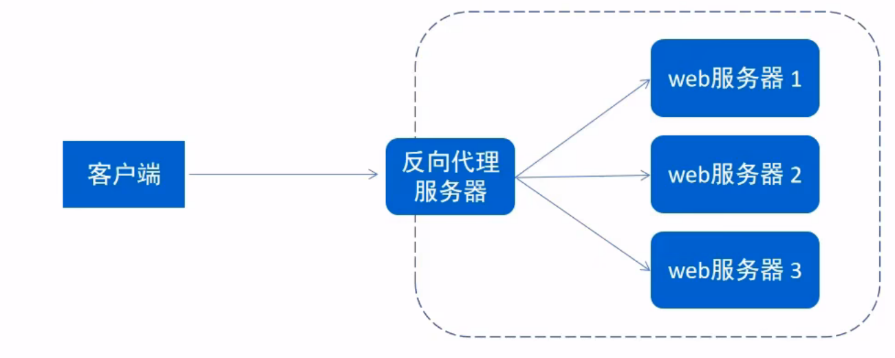
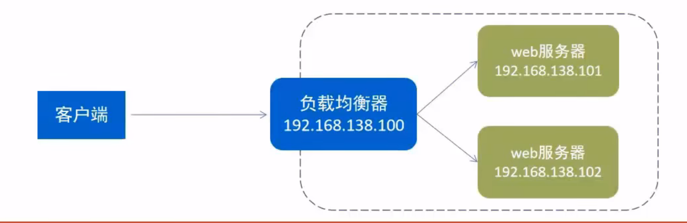

## Nginx概述

### Nginx介绍

Nginx是一款轻量级的Web 服务器／反向代理服务器及电子邮件（IMAP/POP3）代理服务器。其特点是占有内存少，并发能力强，事实上nginx的并发能力在同类型的网页服务器中表现较好，中国大陆使用nginx的网站有：百度、京东、新浪、网易、腾讯、淘宝等。
Nginx是由伊戈尔·赛索耶夫为俄罗斯访问量第二的Rambler.ru站点（俄文：Pam6nep）开发的，第一个公开版本0.1.0发布于2004年10月4日。
官网：https://nginx.org/

###  Nginx下载和安装
可以到Nginx官方网站下载Nginx的安装包，地址为：https://nginx.org/en/download.html

安装过程：

1. 安装依赖包 yum -y install gcc pcre-devel zlib-devel openssl openssl-devel 
2. 下载Nginx安装包wget https://nginx.org/download/nginx-1.16.1.tar.gz
3. 解压 tar -zxvf nginx-1.16.1.tar.gz
4. cd nginx-1.16.1
5. ./configure --prefix=/usr/local/nginx
6. make && make install

### Nginx目录结构

安装完Nginx后，我们先来熟悉一下Nginx的目录结构，如右图：
重点目录／文件：

- conf/nginx.conf	nginx配置文件
- html                   存放静态文件（html、CSS、Js等）
- logs                   日志目录，存放日志文件
- sbin/nginx          二进制文件，用于启动、停止Nginx服务

## Nginx命令

### 查看版本号

`./nginx -v`

### 检查配置文件正确性

在启动Nginx服务之前，可以先检查一下conf/nginx.conf文件配置的是否有错误，命令如下：

`./nginx -t`

### 启动和停止

启动Nginx服务使用如下命令：

`./nginx`

停止Nginx服务使用如下命令：

`./nginx-s stop`

启动完成后可以查看Nginx进程：

`ps -ef | grep nginx`

### 重新加载配置文件

当修改Nginx配置文件后，需要重新加载才能生效，可以使用下面命令重新加载配置文件：

`./nginx -s reload`

## Nginx配置文件结构

#### 整体结构介绍

Nginx配置文件（conf/nginx.conf）整体分为三部分：

- 全局块			和Nginx运行相关的全局配置
- events块                    和网络连接相关的配置
- http块                         代理、缓存、日志记录、虚拟主机配置
  - http全局块           
  - server块
    - ==server全局块==
    - location块

注意：http块中可以配置多个Server块，每个Server块中可以配置多个location块。

## Nginx具体应用

### 部署静态资源

Nginx可以作为静态web服务器来部署静态资源。**静态资源**指在服务端真实存在并且能够直接展示的一些文件，比如常见的html页面、css文件、js文件、图片、视频等资源。
相对于Tomcat,Nginx处理静态资源的能力更加高效，所以在生产环境下，一般都会将静态资源部署到Nginx中。将静态资源部署到Nginx非常简单，只需要将文件复制到Nginx安装目录下的html目录中即可。

```
server {
	listen 80;				＃监听端口
	server_name localhost;	 服务器名称
	location / {				＃匹配客户端请求url
			root html;			＃指定静态资源根目录
			index index.html;	＃指定默认首页
		}
}
```

### 反向代理

- 正向代理
  是一个位于客户端和原始服务器（origin server）之间的服务器，为了从原始服务器取得内容，客户端向代理发送一个
  请求并指定目标（原始服务器），然后代理向原始服务器转交请求并将获得的内容返回给客户端。
  正向代理的典型用途是为在防火墙内的局域网客户端提供访问Internet的途径。
  正向代理一般是在**客户端设置代理服务器**，通过代理服务器转发请求，最终访问到目标服务器。

  

- 反向代理

  反向代理服务器位于用户与目标服务器之间，但是对于用户而言，反向代理服务器就相当于目标服务器，即用户直接访问反向代理服务器就可以获得目标服务器的资源，反向代理服务器负责将请求转发给目标服务器。
  用户不需要知道目标服务器的地址，也无须在用户端作任何设定。

  

- 配置反向代理

  ```
  server{
      listen 82;
      server_name localhost;
      location / {
  		proxy_pass http://192.168.138.101:8080;	＃反向代理配置，将请求转发到指定服务
  	}
  }
  ```

### 负载均衡

早期的网站流量和业务功能都比较简单，单台服务器就可以满足基本需求，但是随着互联网的发展，业务流量越来越大并且业务逻辑也越来越复杂，单台服务器的性能及单点故障问题就凸显出来了，因此需要多台服务器组成应用集群，进行性能的水平扩展以及避免单点故障出现。

- 应用集群：将同一应用部署到多台机器上，组成应用集群，接收负载均衡器分发的请求，进行业务处理并返回响应数据
- 负载均衡器：将用户请求根据对应的负载均衡算法分发到应用集群中的一台服务器进行处理



#### 配置负载均衡：

```
upstream targetserver{			#upstream指令可以定义一组服务器
	server 192.168.138.101:8080;
	server 192.168.138.101:8081;
}
server{
	listen	8080;
	server_name localhost;
	location / {
		proxy_pass http://targetserver;
	}
}
```

#### 负载均衡策略:

| 名称       | 说明             |
| ---------- | ---------------- |
| 轮询       | 默认方式         |
| weight     | 权重方式         |
| ip_hash    | 依据ip分配方式   |
| least_conn | 依据最少连接方式 |
| url_hash   | 依据url分配方式  |
| fair       | 依据响应时间方式 |
