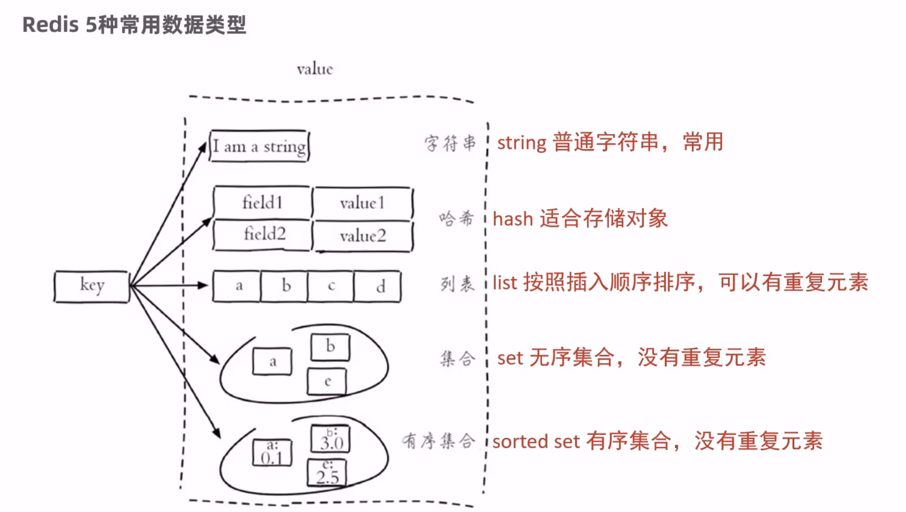

# Redis基础

## 什么是 Redis？

Redis是一个基于**内存**的key-value结构数据库

- 基于内存存储，读写性能高
- 适合存储热点数据（热点商品、咨询、新闻）
- 企业应用广泛

## Redis入门

### Redis简介

Redis is an open source (BSD licensed), in-memory data structure store, used as a database,cache,and
message broker，翻译为：Redis是一个开源的内存中的数据结构存储系统，它可以用作：数据库、缓存和消息中间件。官网：https://redis.io

Redis是用C语言开发的一个开源的高性能键值对（key-value）数据库，官方提供的数据是可以达到100000＋的QPS（每秒内查询次数）。它存储的value类型比较丰富，也被称为结构化的NoSql数据库。

NoSql (Not Only SQL)，不仅仅是SQL，泛指**非关系型数据库**。NoSql数据库并不是要取代关系型数据库，而是关系型数据库的补充。

- 关系型数据库(RDBMS)
  - Mysql
  - Oracle
  - DB2
  - SQLServer
- 非关系型数据库（NoSql)
  - Redis
  - Mongo db
  - MemCached

**Redis应用场景**

- 缓存
- 任务队列
- 消息队列
- 分布式锁

### Redis下载与安装

Redis安装包分为windos版和Linux版：

- Windows版下载地址：https://github.com/microsoftarchive/redis/releases
- Linux版下载地址：https://download.redis.io/releases/

在Linux系统安装Redis步骤：

1. 将Redis安装包上传到Linux
2. 解压安装包，命令：tar -zxvf redis-4.0.0.tar.gz -C /usr/local
3. 安装Redis的依赖环境gcc，命令：yum install gcc-c++
4. 进入 /usr/local/redis-4.0.0,进行编译，命令：make
5. 进入redis的src目录，进行安装，命令：make install

### Redis服务启动与停止

Linux中redis服务启动，可以使用`redis-server`,默认端口为6379

## 数据类型

**介绍**

Redis存储的是key-value结构的数据,其中key是字符串类型,value有5种常用的数据类型

- 字符串 string
- 哈希 hash
- 列表 list
- 集合 set
- 有序集合 sorted set

**Redis 5种常用数据类型**



## 常用命令

### 字符串 string 操作命令

```
SET key value				设置指定key的值
GET key						获取指定key的值
SETEX key seconds value		设置指定key的值，并将key的过期时间设为 seconds 秒
SETNX key value				只有在 key 不存在时设置 key的值
更多命令可以参考Redis中文网：https://www.redis.net.cn
```

### 哈希 hash 操作命令

Redis hash是一个string类型的 field 和 value 的映射表，hash特别适合用于存储对象，常用命令

```
HSET key field value			将哈希表 key 中的字段 field 的值设为 value
HGET key field					获取存储在哈希表中指定字段的值
HDEL key field					删除存储在哈希表中的指定字段
HKEYS key						获取哈希表中所有字段
HVALS key						获取哈希表中所有值
HGETALL key						获取在哈希表中指定key的所有字段和值
```

### 列表 list 操作命令

Redis 列表是简单的字符串列表，按照插入顺序排序，常用命令

```
LPUSH key value1 [value2]		将一个或多个值插入到列表头部
LRANGE key start stop			获取列表指定范围内的元素
RPOP key						移除并获取列表最后一个元素
LLEN key						获取列表长度
BRPOP key1 [key2 ] timeout		移出并获取列表的最后一个元素， 如果列表没有元素会阻塞列表直到等待超时或发现可弹出元素为止
```


### 集合 set 操作命令

### 有序集合 sorted set 操作命令

### 通用命令


## 在Java中操作Redis

