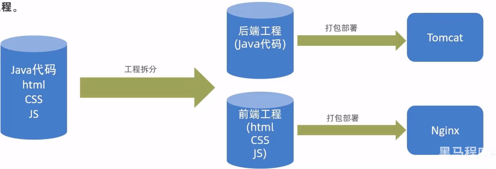
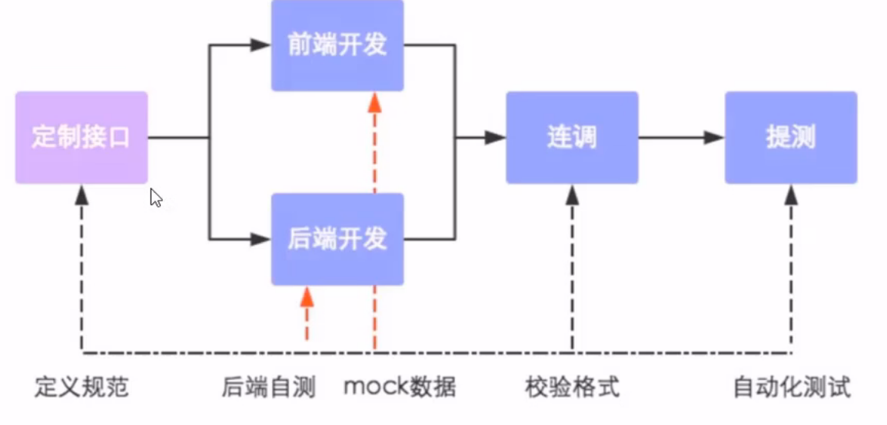

## 介绍

**前后端分离开发**，就是在项目开发过程中,对于前端代码的开发由专门的**前端开发人员**负责，后端代码则由**后端开发人员**负责，这样可以做到分工明确、各司其职，提高开发效率，前后端代码并行开发，可以加快项目开发进度。目前，前后端分离开发方式已经被越来越多的公司所采用，成为当前项目开发的主流开发方式。

前后端分离开发后，从工程结构上也会发生变化，即前后端代码不再混合在同一个maven工程中，而是分为**前端工程**和**后端工程**。

## 开发流程

前后端分离开发后，面临一个问题，就是前端开发人员和后端开发人员如何进行配合来共同开发一个项目？

可以按照如下流程进行：

**接口(API接口):**就是一个http的请求地址,主要就是去定义:请求路径、请求方式、请求参数、响应数据等内容。

## 前端技术栈

**开发工具**

- Visual studio Code
- hbuilder

**技术框架**

- node.js
- VUE
- Element UI
- mock
- webpack
