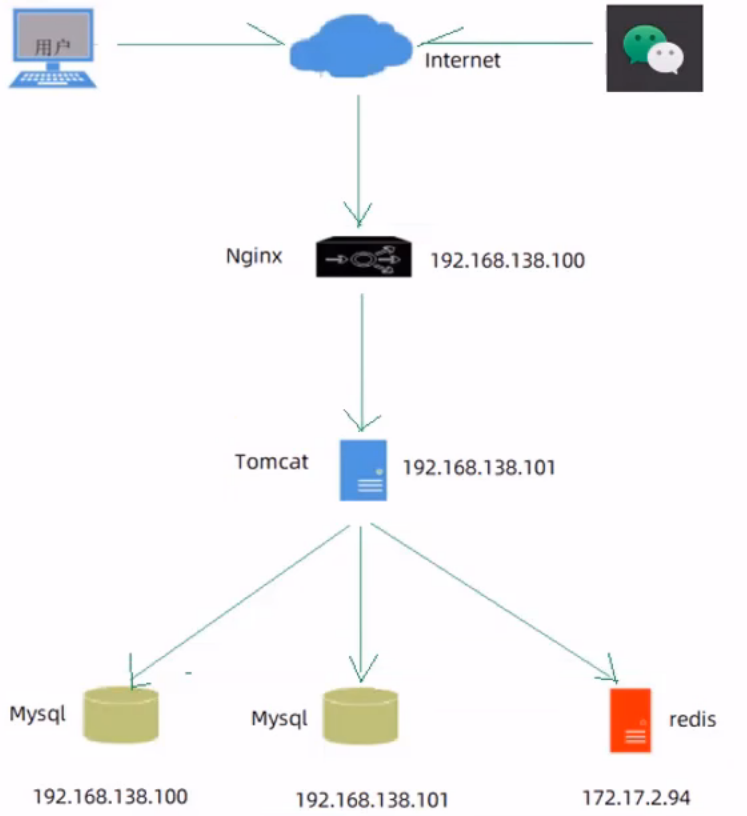

# 项目部署

## 部署架构



## 部署环境说明

**服务器:**

- **192.168.138.128（服务器A)**
  Nginx：部署前端项目、配置反向代理
  Mysql：主从复制结构中的主库
- **192.168.138.129（服务器B)**
  jdk：运行Java项目
  git：版本控制工具
  maven：项目构建工具
  jar:Spring Boot项目打成jar包基于内置Tomcat运行
  Mysql：主从复制结构中的从库
- **172.17.2.94（服务器C)**
  Redis：缓存中间件

## 部署前端项目

1. 在**服务器A**中安装Nginx

2. 修改Nginx配置文件nginx.conf

   ```
   #反向代理配置
   location ^~ /api/ {
   		rewrite ^/api/(.*)$ /$1 break;
   		proxy_pass http://192.168.138.129:8080;
   }
   ```


## 部署后端项目

1. 在服务器B中安装jdk、git、maven、MySQL，使用git clone命令将git远程仓库的代码克隆下来